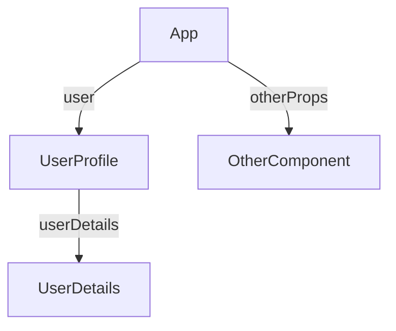
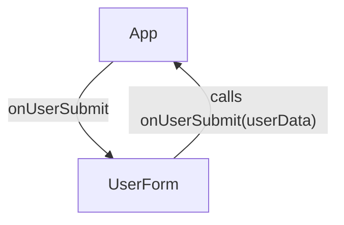
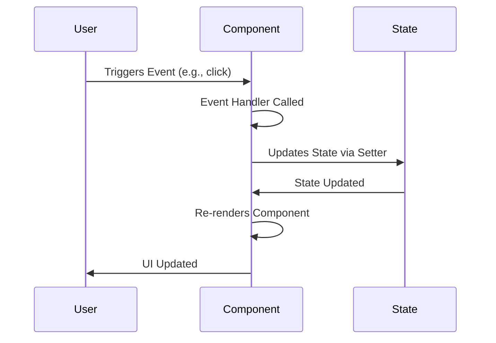
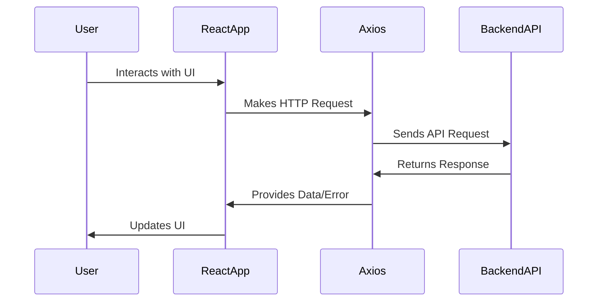
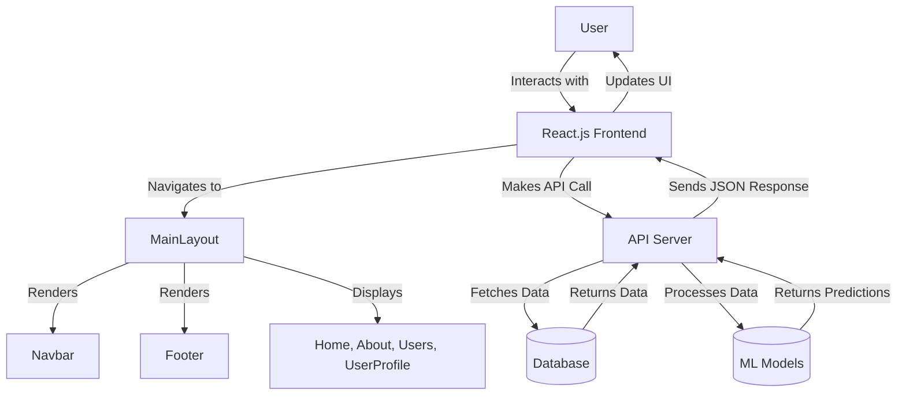
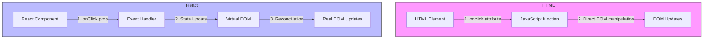
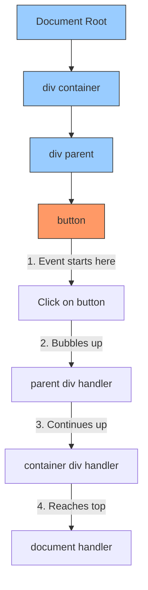
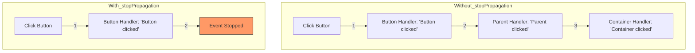

# ReactJS Crash Course for Python Programmers

## Table of Contents

1. [**Introduction to ReactJS**](#1-introduction-to-reactjs)

   - What is ReactJS?
   - Benefits of using ReactJS
   - Comparing ReactJS with Python OOP concepts

2. [**Setting Up the Development Environment**](#2-setting-up-the-development-environment)

   - Installing Node.js and npm
   - Using Vite to create a new React project
   - Project file structure and key files
   - Additional setup steps
   - Installing and setting up React Bootstrap for theming

3. [**Understanding Components**](#3-understanding-components)

   - What are components in React?
   - Functional components
   - Building components using OOP principles
   - Creating your first React component
   - How to add style to component

4. [**Props in React**](#4-props-in-react)

   - Understanding props as component arguments
   - Passing data between components
   - Visualizing Props with a Component Tree Diagram
   - Passing Data from Child to Parent Components
   - Complete Example with Parent and Child Components
   - Tips for Using Props Effectively

5. [**State Management**](#5-state-management)

   - Introduction to state in React
   - Using the `useState` hook
   - Managing state in functional components
   - Best Practices for Managing State
   - Common Mistakes to Avoid
   - More Advanced Examples

6. [**Handling Events**](#6-handling-events)

   - Event handling in React
   - Common Events in React
   - Basic Event Handling Example
   - Passing Arguments to Event Handlers
   - Preventing Default Behavior
   - Handling Events with Input Fields
   - Synthetic Events in React
   - Event Handling in Class Components
   - Common Pitfalls and Things to Look Out For

7. [**Consuming RESTful APIs with Axios**](#7-consuming-restful-apis-with-axios)

   - Introduction to Axios
   - Making GET and POST requests
   - Handling asynchronous data with `useEffect`
   - Understanding the frontend-backend interaction

8. [**React Router**](#8-react-router)

   - Setting up React Router
   - Defining routes and navigation
   - Difference between pages and components
   - Creating a multi-page application

9. [**Project: Building a Simple Web Application**](#9-project-building-a-simple-web-application)

   - Integrating all concepts learned
   - Building a responsive UI with React Bootstrap
   - Fetching and displaying data from an API
   - Implementing navigation with React Router
   - Visualizing application flow with a diagram

10. [**Recap and Further Learning**](#10-recap-and-further-learning)

    - Recap of key concepts
    - Resources for further learning

11. [**FAQs**](#11-faqs)
    - [What is `JSX`?](#what-is-jsx)
    - [Difference Between `.js` and `.jsx` Files](#difference-between-js-and-jsx-files)
    - [What is Babel and Its Relation to React](#what-is-babel-and-its-relation-to-react)
    - [HTML `onclick` vs React `onClick`](#html-onclick-vs-react-onclick)
    - [What is `preventDefault()`?](what-is-preventdefault)
    - [What is `stopPropagation()`?](#what-is-stoppropagation)

---

## 1. Introduction to ReactJS

### What is ReactJS?

ReactJS is an open-source JavaScript library developed by Facebook for building user interfaces, especially for single-page applications. It allows developers to create large web applications that can update and render efficiently in response to data changes.

- **Declarative**: React makes it painless to create interactive UIs. Design simple views for each state, and React will efficiently update and render the right components when your data changes.
- **Component-Based**: Build encapsulated components that manage their own state and compose them to make complex UIs.
- **Virtual DOM**: React uses a virtual DOM to improve performance by minimizing direct manipulation of the actual DOM.

### Benefits of Using ReactJS

- **Performance**: The virtual DOM and efficient diffing algorithms lead to high-performance applications.
- **Reusable Components**: Components can be reused across the application, reducing code duplication.
- **Strong Ecosystem**: A vast ecosystem of tools, libraries, and community support.
- **Flexibility**: Can be used with other libraries or frameworks.

### Comparing ReactJS with Python OOP Concepts

For Python programmers familiar with OOP:

- **Components as Classes**: React components encapsulate data (state) and behavior (methods), similar to Python classes.
- **Props as Parameters**: Props are like function parameters or constructor arguments in Python, used to pass data to components.
- **State as Instance Variables**: State in React components is akin to instance variables in Python classes, representing data that can change over time.

---

## 2. Setting Up the Development Environment

### Installing Node.js and npm

Node.js is a JavaScript runtime that allows you to run JavaScript outside of a browser. npm (Node Package Manager) is used to install and manage packages.

1. **Download Node.js**: Visit [nodejs.org](https://nodejs.org/) and download the LTS (Long Term Support) version suitable for your operating system.
2. **Install Node.js**: Run the installer and follow the prompts.
3. **Verify Installation**:
   - Open a terminal or command prompt.
   - Run `node -v` to check the Node.js version.
   - Run `npm -v` to check the npm version.

### Using Vite to Create a New React Project

Vite is a modern frontend build tool that provides a faster and leaner development experience.

> **Note**: Vite is ideal for creating a new React project from scratch. If you need to convert an existing project to ReactJS, consider other methods instead of using Vite.

#### Steps to Create a New Project:

1. **Create a New Project**:

   ```bash
   npm create vite@latest my-react-app -- --template react
   ```

   This command initializes a new React project named `my-react-app` using Vite.

2. **Navigate to the Project Directory**:

   ```bash
   cd my-react-app
   ```

3. **Install Dependencies**:

   ```bash
   npm install
   ```

4. **Run the Development Server**:

   ```bash
   npm run dev
   ```

   Open your browser and go to the URL provided (usually `http://localhost:5173`) to see your React app running.

### Project File Structure and Key Files

Once the project is created, you'll have the following file structure:

```
my-react-app/
├── node_modules/            # Project dependencies
├── public/                  # Static assets (optional)
│   └── favicon.ico          # Favicon
├── src/                     # Source files for the project
│   ├── assets/              # Static assets like images, fonts, etc.
│   ├── App.css              # Main CSS file for styling the app
│   ├── App.jsx              # Main App component
│   ├── index.css            # Global CSS styles
│   ├── main.jsx             # Entry point for the React app
│   └── vite-env.d.ts        # TypeScript definition file (if TypeScript is used)
├── .gitignore               # Files and directories to ignore in git
├── index.html               # Main HTML file
├── package.json             # Project metadata and dependencies
├── vite.config.js           # Vite configuration file
└── README.md                # Project documentation
```

#### Key Files:

1. **`public/`**: Contains static assets such as images or the favicon, which Vite serves directly without processing.
2. **`src/`**: All source files for your React app.
   - **`App.jsx`**: The main application component where you'll build your app's primary UI.
   - **`main.jsx`**: The entry point for the React application. It renders the `<App />` component into the DOM.
   - **`index.css`**: Global styles for the app.
   - **`assets/`**: A place to store images, fonts, or other static assets used inside the app.
3. **`vite.config.js`**: Configuration file for Vite. Modify this file to change Vite’s behavior, like adding plugins or environment-specific configurations.
4. **`index.html`**: The main HTML file for your app, where the React app is injected.
5. **`package.json`**: Lists project dependencies and scripts for running and building the app.

#### Working with Key Files:

- **`App.jsx`**: This is where you'll spend most of your time developing your application logic and UI.
- **`main.jsx`**: Typically, you won't need to modify this file, but it's good to understand that it initializes your React app and injects it into the DOM.

> **Quick Tip:** If you're starting a new project and plan to use JSX extensively, consider using the .jsx extension for your React components to enhance clarity and maintainability.

### Additional Setup Steps

1. **Create Folders for Organization**:

   Inside the `src` folder, create the following directories to organize your code:

   - `src/components/`: Contains reusable UI components that can be shared across multiple pages, such as headers, footers, buttons, etc.
   - `src/pages/`: Contains the main pages or views of your app, such as `Home.jsx`, `About.jsx`, `Contact.jsx`, and possibly `NotFound.jsx` for handling undefined routes.
   - `src/services/`: Used to manage API calls or utility functions. For example, you can have an `api.js` file to centralize all HTTP requests.

2. **Install Essential Libraries**:

   Install the following libraries to enhance your development:

   - **React Bootstrap**: For styling pages.

     ```bash
     npm install react-bootstrap bootstrap
     ```

   - **React Router DOM**: For building navigation in React.

     ```bash
     npm install react-router-dom react-router-bootstrap
     ```

   - **Axios**: For making HTTP requests to RESTful endpoints.

     ```bash
     npm install axios
     ```

   - **JSZip and FileSaver**: For zipping files and downloading zip files (optional, depending on your project needs).

     ```bash
     npm install jszip file-saver
     ```

### Installing and Setting Up React Bootstrap for Theming

React Bootstrap integrates Bootstrap's CSS framework with React's components.

1. **Import Bootstrap CSS**:

   In your `main.jsx` file, add `import 'bootstrap/dist/css/bootstrap.min.css';` to include Bootstrap's CSS:

   ```jsx
   import { StrictMode } from 'react';
   import { createRoot } from 'react-dom/client';
   import App from './App.jsx';
   import './index.css';
   import 'bootstrap/dist/css/bootstrap.min.css';

   createRoot(document.getElementById('root')).render(
     <StrictMode>
       <App />
     </StrictMode>
   );
   ```

2. **Using React Bootstrap Components**:

   You can now import and use React Bootstrap components in your app. For example:

   ```jsx
   import { Button } from 'react-bootstrap';

   function App() {
     return (
       <div>
         <Button variant='primary'>Click Me</Button>
       </div>
     );
   }

   export default App;
   ```

For more components, please refer to this [site](https://react-bootstrap.netlify.app/docs/components/accordion).

---

## 3. Understanding Components

### What Are Components in React?

Components are the fundamental building blocks of a React application. They enable you to split the UI into independent, reusable pieces that can be managed and developed separately. Each component is a JavaScript function or class that optionally accepts inputs (called "props", which will be cover in next section) and returns a React element that describes a part of the UI.

- **Functional Components**: JavaScript functions that return JSX elements.
- **Class Components**: ES6 classes that extend `React.Component` (less common with the advent of hooks).

### Functional Components

Functional components are simpler and more concise than class components. They are JavaScript functions that accept props as an argument and return JSX.

**Example: A Simple Greeting Component**

```jsx
// src/components/Greeting.jsx

function Greeting() {
  return <h1>Hello, World!</h1>;
}

export default Greeting;
```

**Usage in `App.jsx`**

```jsx
// src/App.jsx

import Greeting from './components/Greeting';

function App() {
  return (
    <div>
      <Greeting/>
    </div>
  );
}

export default App;
```

### Building Components Using OOP Principles

Drawing parallels between React components and Python classes can help you understand how components encapsulate behavior and data.

- **Encapsulation**: Components encapsulate their own structure, styles, and behavior, similar to how classes in OOP encapsulate data and methods.
- **Reusability**: Components can be reused across different parts of the application, reducing code duplication.
- **Abstraction**: Components hide their internal implementation details, exposing only the necessary interface through props.

**Python Class Example**

```python
class Car:
    def __init__(self, make, model):
        self.make = make
        self.model = model

    def display_info(self):
        return f"{self.make} {self.model}"
```

**React Component Equivalent**

```jsx
// src/components/Car.jsx

function Car() {
  return (
    <div>
      <h2>
        {make} {model}
      </h2>
    </div>
  );
}

export default Car;
```

**Usage in `App.jsx`**

```jsx
// src/App.jsx

import Car from './components/Car';

function App() {
  return (
    <div>
      <Car make='Toyota' model='Corolla' />
      <Car make='Honda' model='Civic' />
    </div>
  );
}

export default App;
```

### Tips for Creating and Organizing Components

**Creating the `components` Folder**

Even though we recommended creating a `components` folder earlier, let's ensure you have it properly set up:

1. **Navigate to the `src` Directory**: In your project, go to the `src` folder.
2. **Create the `components` Folder**: Inside `src`, create a new folder named `components`. This folder will hold all your reusable components.

**Organizing Your Components**

- **Consistent Naming**: Use PascalCase for component filenames (e.g., `UserCard.jsx`, `NavBar.jsx`).
- **File Structure**: Keep each component in its own file inside the `components` folder.
- **Subfolders**: If you have a large number of components, consider organizing them into subfolders within `components`.

**Creating Reusable Components**

- **Focus on Single Responsibility**: Each component should do one thing well.
- **Use Props Effectively**: Pass data and event handlers via props to make components flexible.
- **Avoid Hardcoding Values**: Use props instead of hardcoded values to make components reusable in different contexts.

### Creating Your First React Component

**Step 1: Create a New Component File**

Inside the `src/components/` directory, create a file named `Welcome.jsx`:

```jsx
// src/components/Welcome.jsx

function Welcome() {
  return <h1>Welcome!</h1>;
}

export default Welcome;
```

**Step 2: Use the Component in `App.jsx`**

```jsx
// src/App.jsx

import Welcome from './components/Welcome';

function App() {
  return (
    <div>
      <Welcome />
    </div>
  );
}

export default App;
```

**Explanation**:

- **`Welcome.jsx`**: Defines a `Welcome` component that displays a greeting.
- **`App.jsx`**: Imports the `Welcome` component and uses it twice with different `name` props.

### Additional Examples

**Example 1: User Profile Component**

> In this example of `{ user }`, just take it as what it is now and it will be covered in next section.

```jsx
// src/components/UserProfile.jsx

function UserProfile({ user }) {
  return (
    <div className='user-profile'>
      <h2>{user.name}</h2>
      <p>
        <strong>Email:</strong> {user.email}
      </p>
    </div>
  );
}

export default UserProfile;
```

**Usage in `App.jsx`**

```jsx
// src/App.jsx

import UserProfile from './components/UserProfile';

function App() {
  const user = {
    name: 'Jane Doe',
    email: 'jane.doe@example.com',
  };

  return (
    <div>
      <UserProfile user={user} />
    </div>
  );
}

export default App;
```

**Example 2: List Component**

> In this example of `{ items }`, just take it as what it is now and it will be covered in next section.

```jsx
// src/components/ItemList.jsx

function ItemList({ items }) {
  return (
    <ul>
      {items.map((item, index) => (
        <li key={index}>{item}</li>
      ))}
    </ul>
  );
}

export default ItemList;
```

**Usage in `App.jsx`**

```jsx
// src/App.jsx

import ItemList from './components/ItemList';

function App() {
  const fruits = ['Apple', 'Banana', 'Cherry'];

  return (
    <div>
      <h1>Fruit List</h1>
      <ItemList items={fruits} />
    </div>
  );
}

export default App;
```

### Final File Structure at This Step

Your project directory should now look like this:

```
my-react-app/
├── node_modules/
├── public/
│   └── favicon.ico
├── src/
│   ├── assets/
│   ├── components/
│   │   ├── ItemList.jsx
│   │   ├── UserProfile.jsx
│   │   └── Welcome.jsx
│   ├── pages/
│   ├── services/
│   ├── App.css
│   ├── App.jsx
│   ├── index.css
│   ├── main.jsx
│   └── vite-env.d.ts
├── .gitignore
├── index.html
├── package.json
├── vite.config.js
└── README.md
```

**Explanation**:

- **`src/components/`**: Contains all your reusable components.
  - **`ItemList.jsx`**: Renders a list of items.
  - **`UserProfile.jsx`**: Displays user profile information.
  - **`Welcome.jsx`**: A welcome message component.
- **`src/pages/`**: Reserved for page components (will be used in routing).
- **`src/services/`**: Reserved for service functions like API calls.
- **`App.jsx`**: The main application file where components are imported and used.

### Best Practices

- **Keep Components Small and Focused**: Each component should ideally handle one specific task or part of the UI.
- **Reusability**: Design components that can be reused with different data or in different contexts.
- **Separation of Concerns**: Separate your components, styles, and logic to keep the codebase maintainable.

### How to Add Style to Component

You can style components using CSS files, CSS modules, or styled-components.

  **Using a CSS File**:

  ```jsx
  // src/components/CustomButton.jsx

  import './CustomButton.css';

  function CustomButton({ label, onClick }) {
    return (
      <button className='custom-button' onClick={onClick}>
        {label}
      </button>
    );
  }

  export default CustomButton;
  ```

  **CustomButton.css**:

  ```css
  /* src/components/CustomButton.css */

  .custom-button {
    background-color: #007bff;
    color: white;
    padding: 10px 20px;
    border: none;
    cursor: pointer;
  }

  .custom-button:hover {
    background-color: #0056b3;
  }
  ```

### Updating the File Structure with Styles

If you're adding CSS files for styling components, your file structure will look like this:

```
my-react-app/
├── node_modules/
├── public/
│   └── favicon.ico
├── src/
│   ├── assets/
│   ├── components/
│   │   ├── ItemList.jsx
│   │   ├── UserProfile.jsx
│   │   ├── UserProfile.css
│   │   └── Welcome.jsx
│   ├── pages/
│   ├── services/
│   ├── App.css
│   ├── App.jsx
│   ├── index.css
│   ├── main.jsx
│   └── vite-env.d.ts
├── .gitignore
├── index.html
├── package.json
├── vite.config.js
└── README.md
```

**Note**: Each component's CSS file is stored alongside its respective component for better organization.

### Recap

- **Components**: Reusable pieces of UI represented as functions returning JSX.
- **Folder Structure**: Organizing your components in a dedicated folder enhances maintainability.
- **File Naming**: Use clear and consistent naming conventions for files and components.
- **Examples Provided**: Multiple component examples help solidify your understanding of how to create and use components.

By following these guidelines and examples, you should have a solid understanding of how to create, use, and organize components in your React application. This foundational knowledge is crucial as you build more complex applications and start integrating state management, routing, and API interactions.

---

## 4. Props in React

### Understanding Props as Component Arguments

Props (short for "properties") are inputs to components. They are used to pass data from parent components to child components, similar to how parameters are passed to functions or how constructor arguments are passed in classes.

- **Immutable**: Props are read-only inside the component; they cannot be modified by the child component.
- **Data Flow**: Props enable a unidirectional (one-way) data flow from parent to child components.

**Example**:

```jsx
function UserProfile({ user }) {
  return (
    <div>
      <h2>{user.name}</h2>
      <p>{user.email}</p>
    </div>
  );
}

export default UserProfile;
```

### Passing Data Between Components

1. **Parent Component (`App.jsx`)**:

   ```jsx
   import UserProfile from './components/UserProfile';

   function App() {
     const user = {
       name: 'Jane Doe',
       email: 'jane.doe@example.com',
     };

     return (
       <div>
         <UserProfile user={user} />
       </div>
     );
   }

   export default App;
   ```

2. **Child Component (`UserProfile.jsx`)**:

   ```jsx
   function UserProfile({ user }) {
     return (
       <div>
         <h2>{user.name}</h2>
         <p>{user.email}</p>
       </div>
     );
   }

   export default UserProfile;
   ```

**Explanation**:

- The `App` component passes a `user` object as a prop to `UserProfile`.
- The `UserProfile` component receives the `user` prop and displays the user's name and email.

### Visualizing Props with a Component Tree Diagram

To better understand how props are passed from parent to child components, let's visualize the component hierarchy and data flow using a Mermaid diagram.



**Explanation**:

- **App**: The root parent component.
  - Passes `user` prop to `UserProfile`.
  - May pass other props to `OtherComponent`.
- **UserProfile**: Child of `App`.
  - Receives `user` prop from `App`.
  - Might pass `userDetails` prop to its own child component `UserDetails`.

### Key Points About Props

- **Unidirectional Data Flow**: Props flow down from parent to child components. This is known as "top-down" or "unidirectional" data flow.
- **Immutability**: Child components should not modify their props. Props are read-only views of the data that are owned by the parent component.
- **Composition**: Props allow components to be composed together, enabling complex UIs to be built from simple, reusable components.

### Passing Data from Child to Parent Components

> You will need to understand about `State` which is covered in next section.

While props are used to pass data from parent to child, there are situations where you need to communicate from a child component back to its parent. Since data flow in React is unidirectional, we achieve this by passing functions (callbacks) from the parent to the child via props. The child component can then call these functions, passing data as arguments.

**Example**:

1. **Parent Component (`App.jsx`)**:

   ```jsx
   import UserForm from './components/UserForm';

   function App() {
     const handleUserSubmit = (userData) => {
       console.log('User Data from Child:', userData);
     };

     return (
       <div>
         <UserForm onUserSubmit={handleUserSubmit} />
       </div>
     );
   }

   export default App;
   ```

2. **Child Component (`UserForm.jsx`)**:

   ```jsx
   import { useState } from 'react';

   function UserForm({ onUserSubmit }) {
     const [name, setName] = useState('');
     const [email, setEmail] = useState('');

     const handleSubmit = (event) => {
       event.preventDefault();
       const userData = { name, email };
       onUserSubmit(userData); // Call the function passed from parent
     };

     return (
       <form onSubmit={handleSubmit}>
         <input
           type='text'
           placeholder='Name'
           value={name}
           onChange={(e) => setName(e.target.value)}
         />
         <input
           type='email'
           placeholder='Email'
           value={email}
           onChange={(e) => setEmail(e.target.value)}
         />
         <button type='submit'>Submit</button>
       </form>
     );
   }

   export default UserForm;
   ```

**Explanation**:

- **Parent Component (`App`)**:

  - Defines a function `handleUserSubmit` to handle data from the child.
  - Passes `handleUserSubmit` to the child component via the `onUserSubmit` prop.

- **Child Component (`UserForm`)**:
  - Accepts the `onUserSubmit` prop, which is a function.
  - Collects user input for `name` and `email`.
  - Calls `onUserSubmit(userData)` when the form is submitted, effectively sending data back to the parent.

### Visualizing Data Flow with Callbacks

Here's a diagram illustrating how callbacks enable data flow from child to parent:



**Explanation**:

- The `App` component passes a function `onUserSubmit` to `UserForm`.
- `UserForm` invokes `onUserSubmit` when needed, sending `userData` back up to the parent.

### Key Concepts for Child-to-Parent Communication

- **Passing Functions as Props**: Parents pass functions to children via props. These functions can be called by the child to communicate events or data back to the parent.
- **Event Handling**: Commonly used for handling events that originate in the child component, such as user interactions.
- **Data Uplifting**: This pattern is often referred to as "lifting state up," where state is managed in the parent component, and children inform the parent of changes.

### Complete Example with Parent and Child Components

**Parent Component (`App.jsx`)**:

```jsx
import { useState } from 'react';
import Counter from './components/Counter';

function App() {
  const [totalClicks, setTotalClicks] = useState(0);

  const handleIncrement = () => {
    setTotalClicks((prevTotal) => prevTotal + 1);
  };

  return (
    <div>
      <h1>Total Clicks: {totalClicks}</h1>
      <Counter onIncrement={handleIncrement} />
      <Counter onIncrement={handleIncrement} />
    </div>
  );
}

export default App;
```

**Child Component (`Counter.jsx`)**:

```jsx
function Counter({ onIncrement }) {
  return <button onClick={onIncrement}>Click Me</button>;
}

export default Counter;
```

**Explanation**:

- **App Component**:
  - Manages the `totalClicks` state.
  - Passes the `handleIncrement` function to each `Counter` component.
- **Counter Component**:
  - Receives `onIncrement` as a prop.
  - Calls `onIncrement` when the button is clicked, informing the parent of the event.

### Recap of Props in React

- **Props** are used to pass data from parent to child components.
- **Children cannot modify props**, ensuring a unidirectional data flow.
- **Communication from child to parent** is achieved by passing functions (callbacks) as props from the parent to the child.
- **Mermaid diagrams** can help visualize component hierarchies and data flow.

### Tips for Using Props Effectively

- **Props Validation**: Consider using PropTypes to validate the props passed to your components.

  ```bash
  npm install prop-types
  ```

  ```jsx
  // Example in UserProfile.jsx
  import PropTypes from 'prop-types';

  UserProfile.propTypes = {
    user: PropTypes.shape({
      name: PropTypes.string.isRequired,
      email: PropTypes.string.isRequired,
    }).isRequired,
  };
  ```

- **Default Props**: Set default values for props to ensure your components have fallback values.

  ```jsx
  // Example in Greeting.jsx
  Greeting.defaultProps = {
    name: 'Guest',
  };
  ```

- **Destructure Props**: Use destructuring to make your code cleaner.

  ```jsx
  // Instead of
  function Greeting(props) {
    return <h1>Hello, {props.name}!</h1>;
  }

  // Use
  function Greeting({ name }) {
    return <h1>Hello, {name}!</h1>;
  }
  ```

- **PropTypes for Validation**: Use the `prop-types` package to validate props and catch bugs early.

  ```jsx
  import PropTypes from 'prop-types';

  Greeting.propTypes = {
    name: PropTypes.string.isRequired,
  };
  ```

- **Default Props**: Provide default values for props to make components more robust.

  ```jsx
  Greeting.defaultProps = {
    name: 'Guest',
  };
  ```

### Final Thoughts

Understanding how props work in React is essential for building dynamic and interactive applications. Props allow for flexible and reusable components by:

- **Passing Data**: Sharing data between components.
- **Event Handling**: Communicating events from child to parent.
- **Composition**: Building complex UIs from simple components.

By mastering props, you unlock the ability to create a well-structured and maintainable React application.

---

## 5. State Management

### Introduction to State in React

State is a built-in object in React that allows components to create and manage their own data, leading to interactive and dynamic user interfaces. It represents data that can change over time and directly affects what is rendered by the component.

- **Mutable**: Unlike props, which are read-only and passed down from parent components, state is managed within the component and can be updated as needed.
- **Triggers Re-render**: When state changes, React re-renders the component to reflect the new state, ensuring the UI stays in sync with the data.

**Key Points**:

- **State vs. Props**: Props are used to pass data from parent to child components, while state is used to manage data within a component.
- **Isolation**: Each component can have its own state, independent of other components.

### Using the `useState` Hook

The `useState` hook is a fundamental part of React that allows you to add state to functional components.

**Syntax**:

```jsx
const [stateVariable, setStateVariable] = useState(initialValue);
```

**Explanation**:

- **Destructuring Assignment**: `useState` returns an array with two elements:
  - `stateVariable`: The current value of the state.
  - `setStateVariable`: A function that updates the state variable.
- **Naming Convention**: By convention, the setter function is named by prefixing `set` to the state variable name.
- **Initial Value**: The argument `initialValue` sets the initial state, and it should match the expected data type (e.g., number, string, object).

> **Note**: The `useState` hook must be called at the top level of the component function and not inside loops, conditions, or nested functions.

**Example 1: Counter Component**

```jsx
import { useState } from 'react';

function Counter() {
  const [count, setCount] = useState(0); // Initialize 'count' to 0

  const increment = () => {
    setCount((prevCount) => prevCount + 1); // Update state based on previous value
  };

  return (
    <div>
      <p>Count: {count}</p>
      <button onClick={increment}>Increment</button>
    </div>
  );
}

export default Counter;
```

**Explanation**:

- **State Initialization**: The `count` state variable is initialized to `0`.
- **State Update**: Calling `setCount` updates `count` and triggers a re-render.
- **Functional Update**: Using a function inside `setCount` ensures you're working with the latest state, especially when updates are asynchronous.

**Example 2: Toggle Switch**

```jsx
import { useState } from 'react';

function ToggleSwitch() {
  const [isOn, setIsOn] = useState(false); // Initialize 'isOn' to false

  const toggle = () => {
    setIsOn((prevIsOn) => !prevIsOn); // Toggle the state
  };

  return (
    <div>
      <p>The switch is {isOn ? 'ON' : 'OFF'}</p>
      <button onClick={toggle}>Toggle</button>
    </div>
  );
}

export default ToggleSwitch;
```

**Explanation**:

- **Boolean State**: Manages a true/false state to represent the switch's position.
- **Toggling State**: The `toggle` function flips the `isOn` state between `true` and `false`.

### Managing State in Functional Components

#### Multiple State Variables

You can use multiple `useState` hooks to manage different pieces of state within the same component.

**Example: User Profile Form**

```jsx
import { useState } from 'react';

function UserProfileForm() {
  const [firstName, setFirstName] = useState(''); // Initialize to empty string
  const [lastName, setLastName] = useState('');
  const [email, setEmail] = useState('');

  const handleSubmit = (event) => {
    event.preventDefault();
    // Process the form data
    console.log(`User: ${firstName} ${lastName}, Email: ${email}`);
  };

  return (
    <form onSubmit={handleSubmit}>
      <input
        type='text'
        placeholder='First Name'
        value={firstName}
        onChange={(e) => setFirstName(e.target.value)} // Update state on input change
      />
      <input
        type='text'
        placeholder='Last Name'
        value={lastName}
        onChange={(e) => setLastName(e.target.value)}
      />
      <input
        type='email'
        placeholder='Email Address'
        value={email}
        onChange={(e) => setEmail(e.target.value)}
      />
      <button type='submit'>Save Profile</button>
    </form>
  );
}

export default UserProfileForm;
```

**Explanation**:

- **Separate State Variables**: Each form field has its own state variable and setter function.
- **Updating State**: The `onChange` event handlers update the respective state variables when the user types in the input fields.

#### Complex State Objects

Alternatively, you can manage related data using a single state object.

**Example: Using a State Object**

```jsx
import { useState } from 'react';

function UserProfileForm() {
  const [user, setUser] = useState({
    firstName: '',
    lastName: '',
    email: '',
  });

  const handleChange = (event) => {
    const { name, value } = event.target;
    setUser((prevUser) => ({
      ...prevUser,
      [name]: value,
    }));
  };

  const handleSubmit = (event) => {
    event.preventDefault();
    // Process the form data
    console.log(
      `User: ${user.firstName} ${user.lastName}, Email: ${user.email}`
    );
  };

  return (
    <form onSubmit={handleSubmit}>
      <input
        type='text'
        name='firstName'
        placeholder='First Name'
        value={user.firstName}
        onChange={handleChange} // Update state on input change
      />
      <input
        type='text'
        name='lastName'
        placeholder='Last Name'
        value={user.lastName}
        onChange={handleChange}
      />
      <input
        type='email'
        name='email'
        placeholder='Email Address'
        value={user.email}
        onChange={handleChange}
      />
      <button type='submit'>Save Profile</button>
    </form>
  );
}

export default UserProfileForm;
```

**Explanation**:

- **State Object**: Manages all form data within a single `user` object.
- **Spread Operator**: Uses the spread operator (`...prevUser`) to copy existing state and update only the changed field.
- **Dynamic Property Names**: Updates the specific property in the state object corresponding to the `name` attribute of the input.

> For more example on Spread Operator: [W3School](https://www.w3schools.com/react/react_es6_spread.asp), [MDN Web Docs](https://developer.mozilla.org/en-US/docs/Web/JavaScript/Reference/Operators/Spread_syntax)

#### Arrays in State

You can manage arrays in state, such as a list of items.

**Example: Todo List**

```jsx
import { useState } from 'react';

function TodoList() {
  const [tasks, setTasks] = useState([]); // Initialize tasks as an empty array
  const [taskInput, setTaskInput] = useState('');

  const addTask = () => {
    if (taskInput.trim() !== '') {
      setTasks((prevTasks) => [...prevTasks, taskInput.trim()]);
      setTaskInput(''); // Clear the input
    }
  };

  return (
    <div>
      <h2>My Todo List</h2>
      <input
        type='text'
        placeholder='New Task'
        value={taskInput}
        onChange={(e) => setTaskInput(e.target.value)}
      />
      <button onClick={addTask}>Add Task</button>
      <ul>
        {tasks.map((task, index) => (
          <li key={index}>{task}</li> // Use index as key (acceptable here if list items are not reordered)
        ))}
      </ul>
    </div>
  );
}

export default TodoList;
```

**Explanation**:

- **Array State**: Manages a list of tasks using an array in state.
- **Adding Items**: Uses the spread operator to add a new task to the existing array.
- **Rendering Lists**: Maps over the `tasks` array to render each task in the UI.

### Best Practices for Managing State

- **Immutability**: Always treat state as immutable. Do not modify state variables directly; use the setter function to create a new state.
- **Functional Updates**: When updating state based on the previous state, use the functional form of the setter function to ensure you're working with the most recent state.

  ```jsx
  setCount((prevCount) => prevCount + 1);
  ```

- **Initialize State Correctly**: Ensure the initial state matches the expected data type and structure.
- **Avoid Direct State Mutation**: Do not alter state objects or arrays directly (e.g., avoid `stateVariable.push(newItem)`). Instead, create new arrays or objects with the updated values.

### Common Mistakes to Avoid

- **State Updates Are Asynchronous**: Do not rely on the state immediately after calling the setter function. Instead, use the updated state in the next render cycle.

  ```jsx
  // Incorrect
  setCount(count + 1);
  console.log(count); // May still show the old value

  // Correct
  setCount((prevCount) => {
    const newCount = prevCount + 1;
    console.log(newCount);
    return newCount;
  });
  ```

- **Incorrect Use of State**: Avoid updating state in a way that depends on the current state without using the functional form, as it can lead to stale state issues.

### More Advanced Examples

**Example: Shopping Cart**

```jsx
import { useState } from 'react';

function ShoppingCart() {
  const [cartItems, setCartItems] = useState([]);

  const addItem = (product) => {
    setCartItems((prevItems) => [...prevItems, product]);
  };

  const removeItem = (indexToRemove) => {
    setCartItems((prevItems) =>
      prevItems.filter((_, index) => index !== indexToRemove)
    );
  };

  return (
    <div>
      <h2>Shopping Cart</h2>
      {/* Render cart items */}
      <ul>
        {cartItems.map((item, index) => (
          <li key={index}>
            {item.name} - ${item.price.toFixed(2)}{' '}
            <button onClick={() => removeItem(index)}>Remove</button>
          </li>
        ))}
      </ul>
      {/* Add items to cart */}
      <button onClick={() => addItem({ name: 'Apple', price: 0.99 })}>
        Add Apple
      </button>
      <button onClick={() => addItem({ name: 'Banana', price: 0.79 })}>
        Add Banana
      </button>
    </div>
  );
}

export default ShoppingCart;
```

**Explanation**:

- **Adding Items**: Adds a new product object to the `cartItems` array.
- **Removing Items**: Filters out the item at the specified index to create a new array.
- **State as an Array of Objects**: Manages complex data structures in state.

### Understanding Re-renders

- **Re-rendering**: When state changes, React re-renders the component to reflect the new state in the UI.
- **Performance Considerations**: Minimize unnecessary re-renders by carefully managing state and using tools like `React.memo` if needed.
- **State Should Be Minimal**: Only store in state what is necessary for rendering. Derived data can be calculated during rendering.

### State and Props Together

Often, you'll use state and props together to build dynamic and interactive components.

**Example: Parent and Child Components**

```jsx
// Parent Component: ChatApp.jsx
import { useState } from 'react';
import MessageList from './components/MessageList';
import MessageInput from './components/MessageInput';

function ChatApp() {
  const [messages, setMessages] = useState([]);

  const addMessage = (text) => {
    setMessages((prevMessages) => [...prevMessages, { text }]);
  };

  return (
    <div>
      <h1>Chat Room</h1>
      <MessageList messages={messages} />
      <MessageInput onSend={addMessage} />
    </div>
  );
}

export default ChatApp;

// Child Component: MessageList.jsx
function MessageList({ messages }) {
  return (
    <ul>
      {messages.map((msg, index) => (
        <li key={index}>{msg.text}</li>
      ))}
    </ul>
  );
}

export default MessageList;

// Child Component: MessageInput.jsx
import { useState } from 'react';

function MessageInput({ onSend }) {
  const [message, setMessage] = useState('');

  const handleSend = () => {
    if (message.trim() !== '') {
      onSend(message.trim());
      setMessage(''); // Clear input
    }
  };

  return (
    <div>
      <input
        type="text"
        placeholder="Type a message..."
        value={message}
        onChange={(e) => setMessage(e.target.value)}
      />
      <button onClick={handleSend}>Send</button>
    </div>
  );
}

export default MessageInput;
```

**Explanation**:

- **Parent Component (`ChatApp`)**:
  - Manages the `messages` state.
  - Passes `messages` to `MessageList` via props to display them.
  - Passes `addMessage` function to `MessageInput` via props to handle new messages.
- **Child Components**:
  - `MessageList` renders the list of messages.
  - `MessageInput` captures user input and sends new messages back to the parent using the `onSend` callback.

### Summary

- **State is Essential**: It allows components to manage and respond to user input, server responses, and other dynamic data.
- **`useState` Hook**: The primary method to add state to functional components.
- **State Updates are Asynchronous**: Plan accordingly, especially when updates depend on previous state values.
- **Immutability is Key**: Always create new state objects or arrays rather than mutating existing ones to ensure predictable state changes.
- **Combine State and Props**: Use them together to create interactive and data-driven UIs.

### Additional Resources

- **React Documentation on State**: [State and Lifecycle](https://reactjs.org/docs/state-and-lifecycle.html)
- **Understanding the `useState` Hook**: [Using the State Hook](https://reactjs.org/docs/hooks-state.html)
- **State Management Patterns**:
  - **Lifting State Up**: When multiple components need to reflect the same changing data, move the state upwards to the closest common ancestor.
  - **Context API**: For sharing data that can be considered "global" for a tree of React components.

---

## 6. Handling Events

### Introduction to Event Handling in React

Event handling in React is similar to handling events in the DOM, but with some syntactic differences and optimizations. React provides a synthetic event system that wraps the native browser events, ensuring cross-browser compatibility and performance.

**Key Points:**

- **Synthetic Events**: React's synthetic events normalize events across different browsers, providing a consistent API.
- **CamelCase Naming**: Event handlers in React are named using camelCase, unlike the lowercase naming in HTML.
- **Passing Functions**: You pass a function as the event handler, not a string.

**Comparison with HTML Event Handling:**

- **HTML:**

  ```html
  <button onclick="handleClick()">Click Me</button>
  ```

- **React:**

  ```jsx
  <button onClick={handleClick}>Click Me</button>
  ```

### Common Events in React

React supports all common DOM events, including:

- **Mouse Events**: `onClick`, `onDoubleClick`, `onMouseEnter`, `onMouseLeave`
- **Keyboard Events**: `onKeyDown`, `onKeyUp`, `onKeyPress`
- **Form Events**: `onChange`, `onSubmit`, `onFocus`, `onBlur`
- **Clipboard Events**: `onCopy`, `onCut`, `onPaste`
- **Touch Events**: `onTouchStart`, `onTouchMove`, `onTouchEnd`

### Basic Event Handling Example

**Example: Button Click Alert**

```jsx
function ClickMeButton() {
  const handleClick = () => {
    alert('Button clicked!');
  };

  return <button onClick={handleClick}>Click Me</button>;
}

export default ClickMeButton;
```

**Explanation:**

- **Event Handler Function**: `handleClick` is a function defined within the component.
- **Event Binding**: The `onClick` attribute is set to the `handleClick` function.
- **Action**: When the button is clicked, the alert is displayed.

### Passing Arguments to Event Handlers

Sometimes you need to pass additional parameters to your event handler functions.

**Example: Passing Parameters**

```jsx
function ItemList({ items }) {
  const handleClick = (itemId) => {
    console.log(`Item clicked: ${itemId}`);
  };

  return (
    <ul>
      {items.map((item) => (
        <li key={item.id}>
          <button onClick={() => handleClick(item.id)}>{item.name}</button>
        </li>
      ))}
    </ul>
  );
}

export default ItemList;
```

**Explanation:**

- **Arrow Function in Event Handler**: We use an arrow function inside `onClick` to pass `item.id` to `handleClick`.
- **Caution**: Defining functions inside `render` can have performance implications if not managed properly.

### Preventing Default Behavior

In event handlers, you might want to prevent the default action of an event (e.g., preventing a form submission from reloading the page).

**Example: Preventing Form Submission Default Behavior**

```jsx
function SearchForm() {
  const handleSubmit = (event) => {
    event.preventDefault(); // Prevents page reload
    console.log('Form submitted');
  };

  return (
    <form onSubmit={handleSubmit}>
      <input type='text' placeholder='Search...' />
      <button type='submit'>Search</button>
    </form>
  );
}

export default SearchForm;
```

**Explanation:**

- **Event Object**: The event handler receives the event object `event` by default.
- **`event.preventDefault()`**: Prevents the default action associated with the event.

### Handling Events with Input Fields

Managing state in response to user input is a common task.

**Example: Controlled Input Component**

```jsx
import { useState } from 'react';

function NameInput() {
  const [name, setName] = useState('');

  const handleChange = (event) => {
    setName(event.target.value); // Update state with input value
  };

  return (
    <div>
      <input
        type='text'
        value={name}
        onChange={handleChange}
        placeholder='Enter your name'
      />
      <p>Hello, {name}!</p>
    </div>
  );
}

export default NameInput;
```

**Explanation:**

- **Controlled Component**: The input's value is controlled by React state.
- **Updating State**: `handleChange` updates the `name` state whenever the input value changes.
- **Display**: The current value of `name` is displayed in a paragraph.

### Synthetic Events in React

React's synthetic event system is a cross-browser wrapper around the browser's native event system.

**Advantages:**

- **Consistency**: Provides consistent behavior across different browsers.
- **Performance**: Events are pooled and reused, reducing memory overhead (Note: As of React 17, event pooling has been deprecated).

**Event Object Properties:**

- `event.type`: The type of event (e.g., `click`, `change`).
- `event.target`: The DOM element that triggered the event.
- `event.currentTarget`: The DOM element the event handler is bound to.
- `event.preventDefault()`: Prevents the default action.
- `event.stopPropagation()`: Stops the event from bubbling up the DOM tree.

### Event Handling in Class Components

While functional components are now the standard with React hooks, understanding event handling in class components can be helpful.

**Example: Event Handling in Class Component**

```jsx
import React from 'react';

class ToggleParagraph extends React.Component {
  constructor(props) {
    super(props);
    this.state = { isVisible: true };

    // Binding 'this' to event handler
    this.toggle = this.toggle.bind(this);
  }

  toggle() {
    this.setState((prevState) => ({
      isVisible: !prevState.isVisible,
    }));
  }

  render() {
    return (
      <div>
        <button onClick={this.toggle}>
          {this.state.isVisible ? 'Hide' : 'Show'} Paragraph
        </button>
        {this.state.isVisible && <p>This is a toggleable paragraph.</p>}
      </div>
    );
  }
}

export default ToggleParagraph;
```

**Explanation:**

- **Binding**: In class components, you need to bind event handlers to `this` in the constructor.
- **State Management**: `this.state` holds the component's state.
- **Updating State**: `this.setState()` updates the state and triggers a re-render.

### Common Pitfalls and Things to Look Out For

#### 1. Forgetting to Bind `this` in Class Components

In class components, event handlers do not have access to `this` by default.

**Solution:**

- **Bind in Constructor**:

  ```jsx
  this.handleClick = this.handleClick.bind(this);
  ```

- **Use Arrow Functions**:

  ```jsx
  handleClick = () => {
    // ...
  };
  ```

#### 2. Using Arrow Functions in Render

Defining arrow functions inside the render method can lead to performance issues due to unnecessary re-creations of the function on each render.

**Example:**

```jsx
<button onClick={() => this.handleClick(item.id)}>Click Me</button>
```

**Consideration:**

- For most applications, this performance impact is negligible.
- In performance-critical applications, consider binding functions in the constructor or using hooks like `useCallback`.

#### 3. Event Pooling

Prior to React 17, React used event pooling, meaning the `event` object was reused and its properties nullified after the event callback.

**Implication:**

- Accessing `event` properties asynchronously could lead to unexpected `null` values.

**Solution:**

- **Avoided in React 17+**: Event pooling has been removed.
- **If Using Older React Versions**: Call `event.persist()` to persist the event object.

#### 4. Preventing Default Behavior

Forgetting to prevent default behavior can lead to unwanted page reloads or navigation.

**Example:**

- **Form Submission**: Not calling `event.preventDefault()` in a form's `onSubmit` handler will cause the page to reload.

#### 5. Modifying State Directly

Directly modifying the state instead of using the setter function can cause state inconsistencies.

**Incorrect:**

```jsx
const handleClick = () => {
  isVisible = !isVisible; // Direct modification (won't trigger re-render)
};
```

**Correct:**

```jsx
const handleClick = () => {
  setIsVisible((prev) => !prev); // Use setter function
};
```

### Advanced Event Handling

#### Passing Event Objects to Handlers

You can access the event object in your event handlers.

**Example:**

```jsx
function LogInput() {
  const handleKeyPress = (event) => {
    console.log(`Key pressed: ${event.key}`);
  };

  return <input type='text' onKeyPress={handleKeyPress} />;
}

export default LogInput;
```

#### Handling Events in Lists

When rendering lists, you might need to handle events for each item.

**Example:**

```jsx
function TodoList({ tasks }) {
  const handleDelete = (taskId) => {
    // Delete task logic
  };

  return (
    <ul>
      {tasks.map((task) => (
        <li key={task.id}>
          {task.name}
          <button onClick={() => handleDelete(task.id)}>Delete</button>
        </li>
      ))}
    </ul>
  );
}

export default TodoList;
```

#### Conditional Event Handling

You can conditionally handle events based on certain conditions.

**Example: Disabled Button**

```jsx
function SubmitButton({ isFormValid }) {
  const handleSubmit = () => {
    // Submit form
  };

  return (
    <button onClick={handleSubmit} disabled={!isFormValid}>
      Submit
    </button>
  );
}

export default SubmitButton;
```

### Event Delegation and Propagation

#### Event Bubbling

Events propagate up the DOM tree by default. In React, you can control this behavior.

**Example: Stopping Event Propagation**

```jsx
function ParentComponent() {
  const handleParentClick = () => {
    console.log('Parent clicked');
  };

  const handleChildClick = (event) => {
    event.stopPropagation(); // Prevents event from bubbling up
    console.log('Child clicked');
  };

  return (
    <div onClick={handleParentClick}>
      <button onClick={handleChildClick}>Click Me</button>
    </div>
  );
}

export default ParentComponent;
```

**Explanation:**

- **`event.stopPropagation()`**: Stops the event from bubbling up to parent elements.

### Diagrams Illustrating Event Flow

**Event Handling Flow Diagram:**



**Explanation:**

1. **User Interaction**: The user triggers an event (e.g., clicks a button).
2. **Event Handler Execution**: The component's event handler function is called.
3. **State Update**: The event handler updates the component's state using the setter function.
4. **Re-rendering**: React re-renders the component to reflect the new state.
5. **UI Update**: The updated UI is presented to the user.

### Best Practices

#### Keep Event Handlers Clean

- **Single Responsibility**: Event handlers should focus on a single task.
- **Avoid Side Effects**: Keep side effects (e.g., logging, API calls) minimal within event handlers.

#### Naming Conventions

- **Descriptive Names**: Use clear and descriptive names for event handlers, such as `handleSubmit`, `handleChange`, `onClickButton`.
- **Prefixing**: Use prefixes like `handle` for event handlers and `on` for props expecting event handlers.

#### Avoid Anonymous Functions When Necessary

While using anonymous functions in event handlers is convenient, it can affect performance in large lists or complex components.

- **Example**:

  ```jsx
  // Creates a new function on every render
  <button onClick={() => handleClick(item.id)}>Click Me</button>
  ```

- **Optimization**:

  Use `useCallback` to memoize event handlers when necessary.

  ```jsx
  import { useCallback } from 'react';

  const handleClick = useCallback(() => {
    // Handler code
  }, [dependencies]);
  ```

### Integrating with Keyboard Events

Handling keyboard events enhances accessibility and user experience.

**Example: Handling Key Presses**

```jsx
function SearchBox() {
  const [query, setQuery] = useState('');

  const handleKeyDown = (event) => {
    if (event.key === 'Enter') {
      // Trigger search
      console.log(`Searching for: ${query}`);
    }
  };

  return (
    <input
      type='text'
      value={query}
      onChange={(e) => setQuery(e.target.value)}
      onKeyDown={handleKeyDown}
      placeholder='Press Enter to search'
    />
  );
}

export default SearchBox;
```

**Explanation:**

- **`onKeyDown` Event**: Captures key presses.
- **Conditional Logic**: Checks if the `Enter` key is pressed.

### Combining Multiple Event Handlers

You can combine multiple event handlers for complex interactions.

**Example: Drag and Drop**

```jsx
function DraggableItem() {
  const handleDragStart = (event) => {
    event.dataTransfer.setData('text/plain', event.target.id);
  };

  const handleDragOver = (event) => {
    event.preventDefault(); // Allows dropping
  };

  const handleDrop = (event) => {
    event.preventDefault();
    const data = event.dataTransfer.getData('text/plain');
    // Handle the drop action
  };

  return (
    <div>
      <div
        id='draggable'
        draggable='true'
        onDragStart={handleDragStart}
        style={{ width: '100px', height: '100px', backgroundColor: 'blue' }}
      >
        Drag Me
      </div>
      <div
        onDragOver={handleDragOver}
        onDrop={handleDrop}
        style={{
          width: '200px',
          height: '200px',
          backgroundColor: 'lightgray',
          marginTop: '20px',
        }}
      >
        Drop Here
      </div>
    </div>
  );
}

export default DraggableItem;
```

**Explanation:**

- **`draggable` Attribute**: Makes the element draggable.
- **Drag Events**: `onDragStart`, `onDragOver`, and `onDrop` handle drag-and-drop interactions.
- **Data Transfer**: Uses `event.dataTransfer` to pass data during the drag-and-drop process.

### Conclusion

Event handling is a fundamental aspect of React that allows you to create interactive and dynamic user interfaces. By understanding how to effectively handle events, you can build applications that respond intuitively to user actions.

**Key Takeaways:**

- **Synthetic Events**: React's synthetic event system ensures cross-browser compatibility.
- **Unidirectional Data Flow**: Events trigger state updates, which then update the UI.
- **Performance Considerations**: Be mindful of defining functions within render methods.
- **Accessibility**: Proper event handling improves the accessibility and usability of your application.

### Additional Resources

- **React Documentation on Events**: [Handling Events](https://reactjs.org/docs/handling-events.html)
- **Event Reference**: [SyntheticEvent](https://reactjs.org/docs/events.html)
- **Advanced Patterns**:
  - **Higher-Order Components (HOCs)**
  - **Render Props**

---

## 7. Consuming RESTful APIs with Axios

### Introduction to `useEffect`

#### What is `useEffect`?

The `useEffect` hook is one of the most powerful and commonly used hooks in React. It allows you to perform side effects in your functional components. Side effects are actions that affect something outside the scope of the function being executed, such as:

- Data fetching
- Setting up a subscription
- Manually changing the DOM
- Logging

**Key Points:**

- **Effectful Operations:** `useEffect` is used for operations that have effects beyond returning a value.
- **Replacement for Lifecycle Methods:** In class components, you would use lifecycle methods like `componentDidMount`, `componentDidUpdate`, and `componentWillUnmount`. In functional components, `useEffect` serves a similar purpose.

#### Syntax

```jsx
useEffect(() => {
  // Effect code here
  return () => {
    // Cleanup code here (optional)
  };
}, [dependencies]);
```

- **Effect Function:** The first argument is a function where you perform the side effect.
- **Cleanup Function:** The function can return another function for cleanup.
- **Dependency Array:** The second argument is an array of dependencies that determine when the effect runs.

### How `useEffect` Works

#### Dependency Array

- **No Dependency Array:** If you omit the dependency array, the effect runs after every render.

  ```jsx
  useEffect(() => {
    // Runs after every render
  });
  ```

- **Empty Dependency Array (`[]`):** The effect runs only once, after the initial render (componentDidMount).

  ```jsx
  useEffect(() => {
    // Runs once after initial render
  }, []);
  ```

- **With Dependencies:** The effect runs whenever one of the dependencies changes.

  ```jsx
  useEffect(() => {
    // Runs when 'prop' or 'state' changes
  }, [prop, state]);
  ```

#### Cleanup Function

- **Purpose:** The cleanup function is used to clean up side effects to prevent memory leaks (e.g., clearing timers, canceling subscriptions).

  ```jsx
  useEffect(() => {
    const timer = setTimeout(() => {
      // Do something
    }, 1000);

    return () => {
      clearTimeout(timer); // Cleanup
    };
  }, []);
  ```

### Pros and Cons of `useEffect`

#### Pros

1. **Declarative Side Effects:** Keeps side-effect logic close to where it's needed, improving code readability.
2. **Replacement for Lifecycle Methods:** Simplifies component lifecycle management in functional components.
3. **Cleanup Handling:** Easily handle cleanup to prevent memory leaks.
4. **Dependency Control:** Fine-grained control over when the effect runs.

#### Cons

1. **Potential for Infinite Loops:** Incorrect dependencies can cause the effect to run indefinitely.
2. **Complex Dependencies:** Managing dependencies can become complex, especially with objects or functions.
3. **Overuse:** Using `useEffect` for logic that could be handled elsewhere can make components harder to understand.
4. **Side Effect Timing:** Effects run after render, which can cause issues if you need to perform an action before render.

### Common Pitfalls of `useEffect`

#### 1. Missing Dependencies

**Issue:** Forgetting to include dependencies can lead to stale closures and unexpected behavior.

**Example:**

```jsx
useEffect(() => {
  // Uses 'prop' but 'prop' is not in dependency array
}, []);
```

**Solution:** Include all dependencies in the array.

#### 2. Over-Triggering Effects

**Issue:** Including variables that change frequently in the dependency array can cause the effect to run too often.

**Example:**

```jsx
useEffect(() => {
  // Runs on every render if 'count' changes
}, [count]);
```

**Solution:** Ensure only necessary dependencies are included.

#### 3. Infinite Loops

**Issue:** Updating state within an effect that depends on that state can cause an infinite loop.

**Example:**

```jsx
useEffect(() => {
  setCount(count + 1); // Causes re-render, which triggers useEffect again
}, [count]);
```

**Solution:** Use conditional logic or restructure code to prevent continuous updates.

#### 4. Memory Leaks

**Issue:** Not cleaning up effects can lead to memory leaks, especially with timers or subscriptions.

**Solution:** Return a cleanup function from `useEffect`.

#### 5. Async Functions in `useEffect`

**Issue:** The effect function cannot be async, leading to confusion when fetching data.

**Example (Incorrect):**

```jsx
useEffect(async () => {
  // Incorrect: useEffect function should not be async
  await fetchData();
}, []);
```

**Solution:** Define an async function inside the effect.

```jsx
useEffect(() => {
  const fetchData = async () => {
    await // ...
  };
  fetchData();
}, []);
```

### Examples of Using `useEffect`

#### Example 1: Updating the Document Title

```jsx
import { useState, useEffect } from 'react';

function DocumentTitleUpdater() {
  const [title, setTitle] = useState('Initial Title');

  useEffect(() => {
    document.title = title; // Side effect
  }, [title]); // Runs when 'title' changes

  return (
    <div>
      <input
        type='text'
        value={title}
        onChange={(e) => setTitle(e.target.value)}
        placeholder='Set Document Title'
      />
    </div>
  );
}

export default DocumentTitleUpdater;
```

**Explanation:**

- **Side Effect:** Updates the browser's document title whenever `title` state changes.
- **Dependency:** `useEffect` depends on `title`.

#### Example 2: Listening to Window Resize Events

```jsx
import { useState, useEffect } from 'react';

function WindowSize() {
  const [width, setWidth] = useState(window.innerWidth);

  useEffect(() => {
    const handleResize = () => setWidth(window.innerWidth);

    window.addEventListener('resize', handleResize);

    // Cleanup function
    return () => {
      window.removeEventListener('resize', handleResize);
    };
  }, []); // Empty array ensures effect runs once on mount and cleanup on unmount

  return <div>Window width: {width}px</div>;
}

export default WindowSize;
```

**Explanation:**

- **Effect:** Adds an event listener for window resize.
- **Cleanup:** Removes the event listener when the component unmounts.

### Introduction to Axios

#### What is Axios?

Axios is a promise-based HTTP client for JavaScript that can be used in both the browser and Node.js.

**Features:**

- **Easy to Use:** Simple API for making HTTP requests.
- **Promise-Based:** Uses promises, making it compatible with async/await.
- **Interceptors:** Allows you to intercept requests or responses before they are handled.
- **Automatic JSON Transformation:** Automatically transforms JSON data.
- **Error Handling:** Provides robust error handling capabilities.

#### Installing Axios

```bash
npm install axios
```

### Using `useEffect` with Axios

Combining `useEffect` with Axios allows you to fetch data when your component mounts or when certain dependencies change.

#### Example: Fetching Data on Component Mount

```jsx
import { useState, useEffect } from 'react';
import axios from 'axios';

function UserList() {
  const [users, setUsers] = useState([]);

  useEffect(() => {
    // Define an async function inside the effect
    const fetchUsers = async () => {
      try {
        const response = await axios.get('https://api.example.com/users');
        setUsers(response.data); // Update state with fetched data
      } catch (error) {
        console.error('Error fetching users:', error);
      }
    };

    fetchUsers(); // Call the async function
  }, []); // Empty dependency array ensures this runs once

  return (
    <div>
      <h2>User List</h2>
      <ul>
        {users.map((user) => (
          <li key={user.id}>{user.name}</li>
        ))}
      </ul>
    </div>
  );
}

export default UserList;
```

**Explanation:**

- **Async Function:** Since `useEffect` cannot take an async function directly, we define `fetchUsers` inside it.
- **Data Fetching:** Uses Axios to fetch data from an API.
- **State Update:** Updates the `users` state with the fetched data.

#### Example: Fetching Data When a Prop Changes

```jsx
import { useState, useEffect } from 'react';
import axios from 'axios';

function UserDetails({ userId }) {
  const [user, setUser] = useState(null);

  useEffect(() => {
    if (!userId) return;

    const fetchUser = async () => {
      try {
        const response = await axios.get(
          `https://api.example.com/users/${userId}`
        );
        setUser(response.data);
      } catch (error) {
        console.error(`Error fetching user ${userId}:`, error);
      }
    };

    fetchUser();
  }, [userId]); // Effect runs when 'userId' changes

  if (!user) return <p>Loading...</p>;

  return (
    <div>
      <h2>User Details for {user.name}</h2>
      <p>Email: {user.email}</p>
      {/* Other user details */}
    </div>
  );
}

export default UserDetails;
```

**Explanation:**

- **Dependency:** The effect depends on `userId`.
- **Conditional Fetching:** Checks if `userId` is provided before fetching.
- **Dynamic URL:** Uses a template string to fetch data for a specific user.

### Common Pitfalls with `useEffect` and Axios

#### 1. Forgetting to Handle Unmounted Components

**Issue:** If the component unmounts before the Axios request completes, setting state can cause a memory leak.

**Solution:** Use a variable to track if the component is mounted.

```jsx
useEffect(() => {
  let isMounted = true;

  const fetchData = async () => {
    const result = await axios.get('/api/data');
    if (isMounted) setData(result.data);
  };

  fetchData();

  return () => {
    isMounted = false;
  };
}, []);
```

#### 2. Not Handling Errors

**Issue:** Failing to catch errors can lead to unhandled promise rejections.

**Solution:** Use try/catch blocks or `.catch()`.

#### 3. Infinite Loops Due to Dependencies

**Issue:** Including functions or changing objects in the dependency array can cause the effect to run on every render.

**Solution:** Use `useCallback` or `useMemo` to memoize functions and values.

#### 4. Multiple Concurrent Requests

**Issue:** Rapidly changing dependencies can trigger multiple Axios requests before previous ones complete.

**Solution:** Implement request cancellation using Axios' cancel tokens.

```jsx
useEffect(() => {
  const source = axios.CancelToken.source();

  const fetchData = async () => {
    try {
      const response = await axios.get('/api/data', {
        cancelToken: source.token,
      });
      setData(response.data);
    } catch (error) {
      if (axios.isCancel(error)) {
        console.log('Request canceled:', error.message);
      } else {
        // Handle other errors
      }
    }
  };

  fetchData();

  return () => {
    source.cancel('Operation canceled by the user.');
  };
}, [dependency]);
```

### Best Practices for Using `useEffect` and Axios

#### 1. Keep Effects Focused

- **Single Responsibility:** Each effect should have a clear purpose.
- **Separate Concerns:** Avoid mixing unrelated logic in the same effect.

#### 2. Manage Dependencies Carefully

- **Include All Dependencies:** Ensure that all variables used inside the effect are included in the dependency array.
- **Memoize Functions:** Use `useCallback` to prevent unnecessary effect triggers.

#### 3. Handle Errors Gracefully

- **User Feedback:** Provide user feedback when errors occur.
- **Logging:** Log errors for debugging purposes.

#### 4. Cleanup Subscriptions and Async Calls

- **Prevent Memory Leaks:** Clean up subscriptions and cancel async calls in the cleanup function.
- **Use AbortController (Fetch API):** When using the Fetch API, you can use `AbortController` to cancel requests.

### Advanced Examples

#### Example: Searching with Debounce

Implementing a search input that fetches results as the user types, but debounces the input to prevent excessive requests.

```jsx
import { useState, useEffect } from 'react';
import axios from 'axios';

function SearchUsers() {
  const [query, setQuery] = useState('');
  const [users, setUsers] = useState([]);

  useEffect(() => {
    if (!query) {
      setUsers([]);
      return;
    }

    const delayDebounceFn = setTimeout(() => {
      const fetchUsers = async () => {
        try {
          const response = await axios.get(
            `https://api.example.com/users?search=${query}`
          );
          setUsers(response.data);
        } catch (error) {
          console.error('Error fetching users:', error);
        }
      };

      fetchUsers();
    }, 500); // Wait 500ms after the user stops typing

    return () => clearTimeout(delayDebounceFn);
  }, [query]);

  return (
    <div>
      <input
        type='text'
        placeholder='Search Users...'
        value={query}
        onChange={(e) => setQuery(e.target.value)}
      />
      <ul>
        {users.map((user) => (
          <li key={user.id}>{user.name}</li>
        ))}
      </ul>
    </div>
  );
}

export default SearchUsers;
```

**Explanation:**

- **Debouncing:** Uses `setTimeout` to delay the API call until the user stops typing.
- **Cleanup:** Clears the timeout if the component unmounts or if `query` changes.

#### Example: Paginated Data Fetching

Fetching data with pagination support.

```jsx
import { useState, useEffect } from 'react';
import axios from 'axios';

function PaginatedList() {
  const [items, setItems] = useState([]);
  const [page, setPage] = useState(1);

  useEffect(() => {
    let cancel;

    const fetchItems = async () => {
      try {
        const response = await axios.get(
          `https://api.example.com/items?page=${page}`,
          {
            cancelToken: new axios.CancelToken((c) => (cancel = c)),
          }
        );
        setItems((prevItems) => [...prevItems, ...response.data]);
      } catch (error) {
        if (axios.isCancel(error)) return;
        console.error('Error fetching items:', error);
      }
    };

    fetchItems();

    return () => cancel();
  }, [page]);

  const loadMore = () => setPage((prevPage) => prevPage + 1);

  return (
    <div>
      <h2>Items List</h2>
      <ul>
        {items.map((item) => (
          <li key={item.id}>{item.name}</li>
        ))}
      </ul>
      <button onClick={loadMore}>Load More</button>
    </div>
  );
}

export default PaginatedList;
```

**Explanation:**

- **Pagination:** Fetches additional pages of data when `page` state changes.
- **State Management:** Appends new items to the existing list.

### Visualizing Frontend-Backend Interaction

Understanding how the frontend and backend communicate is crucial.



**Explanation:**

1. **User Interaction:** User interacts with the React application.
2. **HTTP Request:** React app uses Axios to make an HTTP request to the backend API.
3. **Backend Response:** Backend processes the request and sends back a response.
4. **Data Handling:** Axios provides the response data or error to the React app.
5. **UI Update:** React app updates the UI based on the response.

### Conclusion

Combining `useEffect` with Axios allows you to effectively manage side effects like data fetching in your React applications. By understanding how to use `useEffect` properly and being aware of common pitfalls, you can build robust, efficient, and maintainable components that interact seamlessly with backend APIs.

**Key Takeaways:**

- **`useEffect` Hook:** Used for managing side effects in functional components.
- **Axios:** A powerful HTTP client for making API requests.
- **Best Practices:** Include proper error handling, cleanup functions, and dependency management.
- **Common Pitfalls:** Be cautious of infinite loops, memory leaks, and unnecessary re-renders.

**Next Steps:**

- **Explore Advanced Hooks:** Learn about `useMemo`, `useCallback`, and custom hooks.
- **State Management Libraries:** Consider using libraries like Redux or Context API for complex state management.
- **Error Boundaries:** Implement error boundaries to catch JavaScript errors in components.

---

## 8. React Router

### Introduction to React Router

React Router is a powerful library that enables dynamic routing in React applications. It allows you to create Single Page Applications (SPAs) with navigation and routing capabilities without reloading the entire page. React Router uses components to render appropriate information depending on the URL path.

### Why Use React Router?

- **Client-Side Routing**: Manage navigation within your React app without server-side redirects.
- **Dynamic Routing**: Routes are defined using standard React components, allowing for dynamic route configurations.
- **Nested Routes**: Support for nested and hierarchical routing structures.
- **URL Parameters**: Ability to capture and use parameters from the URL.

### Setting Up React Router

#### Step 1: Install React Router

You need to install the `react-router-dom` package, which provides DOM bindings for React Router.

```bash
npm install react-router-dom
```

#### Step 2: Basic Setup in `App.jsx`

Set up the router in your main application file.

```jsx
// src/App.jsx

import { BrowserRouter as Router, Routes, Route, Link } from 'react-router-dom';
import Home from './pages/Home';
import About from './pages/About';

function App() {
  return (
    <Router>
      {/* Navigation Links */}
      <nav>
        <Link to='/'>Home</Link>
        <Link to='/about'>About</Link>
      </nav>

      {/* Route Definitions */}
      <Routes>
        <Route path='/' element={<Home />} />
        <Route path='/about' element={<About />} />
      </Routes>
    </Router>
  );
}

export default App;
```

**Explanation:**

- **`<Router>`**: Wraps the entire application to enable routing capabilities.
- **`<nav>`**: Contains navigation links using the `<Link>` component.
- **`<Routes>`**: Encapsulates all your `<Route>` components.
- **`<Route>`**: Defines a mapping between a URL path and a component to render.

### Building Block Concepts

Let's break down the key components and concepts step by step.

#### 1. The `<Router>` Component

- **Purpose**: The `<Router>` component provides the routing context to its child components.
- **Usage**: Typically wraps around your entire application.

```jsx
import { BrowserRouter as Router } from 'react-router-dom';

function App() {
  return <Router>{/* Your components go here */}</Router>;
}
```

#### 2. The `<Routes>` and `<Route>` Components

- **`<Routes>`**: Replaces the older `<Switch>` component in React Router v6. It renders the first child `<Route>` or `<Navigate>` that matches the location.
- **`<Route>`**: Defines a path and the element (component) to render when the path matches.

**Example:**

```jsx
import { Routes, Route } from 'react-router-dom';

function App() {
  return (
    <Router>
      <Routes>
        <Route path='/' element={<Home />} />
        <Route path='/about' element={<About />} />
      </Routes>
    </Router>
  );
}
```

#### 3. The `<Link>` Component

- **Purpose**: The `<Link>` component creates a hyperlink to navigate between routes without causing a full page reload.
- **Usage**: Replace traditional `<a>` tags with `<Link>` for internal navigation.

**Example:**

```jsx
import { Link } from 'react-router-dom';

function Navigation() {
  return (
    <nav>
      <Link to='/'>Home</Link>
      <Link to='/about'>About</Link>
    </nav>
  );
}
```

### Creating a Multi-Page Application

Let's build a simple multi-page application step by step.

#### Step 1: Create the Page Components

**1. Home Page (`Home.jsx`)**

```jsx
// src/pages/Home.jsx

function Home() {
  return <h1>Welcome to the Home Page</h1>;
}

export default Home;
```

**2. About Page (`About.jsx`)**

```jsx
// src/pages/About.jsx

function About() {
  return <h1>About Us</h1>;
}

export default About;
```

#### Step 2: Update the Routes in `App.jsx`

```jsx
// src/App.jsx

import { BrowserRouter as Router, Routes, Route, Link } from 'react-router-dom';
import Home from './pages/Home';
import About from './pages/About';

function App() {
  return (
    <Router>
      {/* Navigation */}
      <nav>
        <Link to='/'>Home</Link>
        <Link to='/about'>About</Link>
      </nav>

      {/* Route Definitions */}
      <Routes>
        <Route path='/' element={<Home />} />
        <Route path='/about' element={<About />} />
      </Routes>
    </Router>
  );
}

export default App;
```

**Explanation:**

- **Navigation Links**: Clicking these links changes the URL and renders the corresponding component without reloading the page.
- **Routes**: Each `<Route>` specifies a `path` and the component (`element`) to render when the path matches.

#### Step 3: Adding More Pages

You can add more pages by creating additional components and routes.

**Example: Contact Page**

**`Contact.jsx`**

```jsx
// src/pages/Contact.jsx

function Contact() {
  return <h1>Contact Us</h1>;
}

export default Contact;
```

**Update `App.jsx`**

```jsx
import Contact from './pages/Contact';

// ...

<Routes>
  <Route path='/' element={<Home />} />
  <Route path='/about' element={<About />} />
  <Route path='/contact' element={<Contact />} />
</Routes>;
```

**Add Link**

```jsx
<nav>
  <Link to='/'>Home</Link>
  <Link to='/about'>About</Link>
  <Link to='/contact'>Contact</Link>
</nav>
```

### Dynamic Routing with URL Parameters

React Router allows you to create dynamic routes that include URL parameters. This is useful for rendering components based on data that is part of the URL.

#### Step 1: Create a Component That Uses URL Parameters

**`UserProfile.jsx`**

```jsx
// src/pages/UserProfile.jsx

import { useParams } from 'react-router-dom';

function UserProfile() {
  const { userId } = useParams(); // Extract 'userId' from the URL parameters

  return <h1>User Profile for User ID: {userId}</h1>;
}

export default UserProfile;
```

**Explanation:**

- **`useParams()` Hook**: Extracts parameters from the URL.
- **Dynamic Content**: The component can render different content based on the `userId`.

#### Step 2: Define the Dynamic Route

**Update `App.jsx`**

```jsx
import UserProfile from './pages/UserProfile';

// ...

<Routes>
  <Route path='/' element={<Home />} />
  <Route path='/about' element={<About />} />
  <Route path='/user/:userId' element={<UserProfile />} />
</Routes>;
```

**Explanation:**

- **`:userId`**: The colon indicates that `userId` is a URL parameter.
- **Route Matching**: When the path matches `/user/123`, the `UserProfile` component is rendered with `userId` set to `123`.

#### Step 3: Add Links to Dynamic Routes

You can create links to dynamic routes by including the parameter in the `to` prop.

**Example:**

```jsx
<Link to="/user/1">User 1 Profile</Link>
<Link to="/user/2">User 2 Profile</Link>
```

### Nested Routes

React Router supports nested routes, allowing you to render components within components based on the URL structure.

#### Step 1: Create Nested Components

**`Dashboard.jsx`**

```jsx
// src/pages/Dashboard.jsx

import { Outlet, Link } from 'react-router-dom';

function Dashboard() {
  return (
    <div>
      <h1>Dashboard</h1>
      <nav>
        <Link to='stats'>Stats</Link>
        <Link to='settings'>Settings</Link>
      </nav>
      <Outlet /> {/* Render child routes here */}
    </div>
  );
}

export default Dashboard;
```

**`Stats.jsx`**

```jsx
// src/pages/Stats.jsx

function Stats() {
  return <h2>Dashboard Stats</h2>;
}

export default Stats;
```

**`Settings.jsx`**

```jsx
// src/pages/Settings.jsx

function Settings() {
  return <h2>Dashboard Settings</h2>;
}

export default Settings;
```

#### Step 2: Define Nested Routes

**Update `App.jsx`**

```jsx
import Dashboard from './pages/Dashboard';
import Stats from './pages/Stats';
import Settings from './pages/Settings';

// ...

<Routes>
  <Route path='/' element={<Home />} />
  <Route path='/about' element={<About />} />
  <Route path='/user/:userId' element={<UserProfile />} />
  <Route path='/dashboard/*' element={<Dashboard />}>
    <Route path='stats' element={<Stats />} />
    <Route path='settings' element={<Settings />} />
  </Route>
</Routes>;
```

**Explanation:**

- **Wildcard `*` in Route Path**: Indicates that nested routes will be matched under `/dashboard/`.
- **`<Outlet />`**: A placeholder in `Dashboard` where the nested route components will render.
- **Nested `<Route>` Components**: Define child routes inside the parent route.

#### Step 3: Navigating to Nested Routes

Within `Dashboard.jsx`, the `Link` components navigate to the nested routes.

```jsx
// Inside Dashboard.jsx

<nav>
  <Link to='stats'>Stats</Link>
  <Link to='settings'>Settings</Link>
</nav>
```

- **Relative Paths**: Since these links are within the `/dashboard` route, `to="stats"` navigates to `/dashboard/stats`.

### Programmatic Navigation

Sometimes, you may need to navigate programmatically, such as after a form submission or an API call.

#### Using the `useNavigate` Hook

```jsx
import { useNavigate } from 'react-router-dom';

function Login() {
  const navigate = useNavigate();

  const handleLogin = () => {
    // Perform login logic
    // On success:
    navigate('/dashboard');
  };

  return <button onClick={handleLogin}>Log In</button>;
}

export default Login;
```

**Explanation:**

- **`useNavigate()`**: Returns a function that lets you navigate programmatically.
- **Usage**: Call `navigate('/path')` to redirect the user.

### Redirects

You may want to redirect users from one route to another.

#### Using the `<Navigate>` Component

```jsx
import { Navigate } from 'react-router-dom';

function ProtectedRoute({ isAuthenticated, children }) {
  if (!isAuthenticated) {
    return <Navigate to='/login' replace />;
  }

  return children;
}

export default ProtectedRoute;
```

**Usage in `App.jsx`**

```jsx
<Routes>
  <Route
    path='/dashboard/*'
    element={
      <ProtectedRoute isAuthenticated={isLoggedIn}>
        <Dashboard />
      </ProtectedRoute>
    }
  >
    {/* Nested routes */}
  </Route>
</Routes>
```

**Explanation:**

- **`<Navigate>`**: Redirects to a different route.
- **Protected Routes**: Wrap routes that require authentication with a component that checks authentication and redirects if necessary.

### Handling 404 Not Found

You can catch all unmatched routes and display a 404 page.

```jsx
// src/pages/NotFound.jsx

function NotFound() {
  return <h1>404 - Page Not Found</h1>;
}

export default NotFound;
```

**Update `App.jsx`**

```jsx
import NotFound from './pages/NotFound';

// ...

<Routes>
  {/* Other routes */}
  <Route path='*' element={<NotFound />} />
</Routes>;
```

**Explanation:**

- **Wildcard `*` Route**: Catches any route that doesn't match the defined routes.
- **Order Matters**: Ensure that the wildcard route is placed last so that it doesn't override other routes.

### Passing State via Navigation

You can pass state or data when navigating to a new route.

#### Using `navigate` with State

```jsx
// In the component where you navigate from
import { useNavigate } from 'react-router-dom';

function ProductItem({ product }) {
  const navigate = useNavigate();

  const handleClick = () => {
    navigate('/product-details', { state: { product } });
  };

  return <button onClick={handleClick}>View Details</button>;
}
```

#### Accessing State in the Destination Component

```jsx
import { useLocation } from 'react-router-dom';

function ProductDetails() {
  const location = useLocation();
  const { product } = location.state || {};

  if (!product) {
    return <p>No product data available.</p>;
  }

  return (
    <div>
      <h1>{product.name}</h1>
      <p>{product.description}</p>
    </div>
  );
}

export default ProductDetails;
```

**Explanation:**

- **`navigate('/path', { state })`**: Passes state along with navigation.
- **`useLocation()`**: Accesses the location object, which includes the `state` property.

### Difference Between Pages and Components

Understanding the difference between pages and components helps in organizing your application.

#### Pages

- **Definition**: Components that represent entire views or pages.
- **Characteristics**:
  - Mapped to a route.
  - Often placed in a `pages/` directory.
  - May include multiple child components.
- **Examples**:
  - `Home.jsx`
  - `About.jsx`
  - `Dashboard.jsx`

#### Components

- **Definition**: Reusable UI elements that can be used within pages or other components.
- **Characteristics**:
  - Focus on specific functionality or UI elements.
  - Placed in a `components/` directory.
  - Designed for reusability.
- **Examples**:
  - `Navbar.jsx`
  - `Footer.jsx`
  - `Button.jsx`

### Practical Example: Building a Blog with React Router

Let's build a simple blog application to illustrate how React Router can be used in a real-world scenario.

#### Step 1: Create Blog Post Components

**`BlogList.jsx`**

```jsx
// src/pages/BlogList.jsx

import { Link } from 'react-router-dom';

function BlogList() {
  const posts = [
    { id: 1, title: 'First Post', excerpt: 'This is the first post...' },
    { id: 2, title: 'Second Post', excerpt: 'This is the second post...' },
  ];

  return (
    <div>
      <h1>Blog</h1>
      {posts.map((post) => (
        <div key={post.id}>
          <h2>
            <Link to={`/blog/${post.id}`}>{post.title}</Link>
          </h2>
          <p>{post.excerpt}</p>
        </div>
      ))}
    </div>
  );
}

export default BlogList;
```

**`BlogPost.jsx`**

```jsx
// src/pages/BlogPost.jsx

import { useParams } from 'react-router-dom';

function BlogPost() {
  const { postId } = useParams();

  // For simplicity, using hardcoded data
  const post = {
    1: {
      title: 'First Post',
      content: 'This is the content of the first post.',
    },
    2: {
      title: 'Second Post',
      content: 'This is the content of the second post.',
    },
  }[postId];

  if (!post) {
    return <p>Post not found.</p>;
  }

  return (
    <div>
      <h1>{post.title}</h1>
      <p>{post.content}</p>
      {/* Back to blog list */}
      <Link to='/blog'>Back to Blog</Link>
    </div>
  );
}

export default BlogPost;
```

#### Step 2: Update Routes in `App.jsx`

```jsx
import BlogList from './pages/BlogList';
import BlogPost from './pages/BlogPost';

// ...

<Routes>
  {/* Other routes */}
  <Route path='/blog' element={<BlogList />} />
  <Route path='/blog/:postId' element={<BlogPost />} />
</Routes>;
```

#### Step 3: Add Navigation Links

```jsx
<nav>
  <Link to='/'>Home</Link>
  <Link to='/about'>About</Link>
  <Link to='/blog'>Blog</Link>
</nav>
```

### Summary of Key Concepts

- **Routing Setup**: Wrap your application with `<Router>` and define routes using `<Routes>` and `<Route>`.
- **Navigation**: Use `<Link>` for client-side navigation without page reloads.
- **Dynamic Routes**: Use URL parameters to create dynamic routes.
- **Nested Routes**: Build hierarchical navigation structures with nested routes and the `<Outlet>` component.
- **Programmatic Navigation**: Use `useNavigate` for navigation in response to events.
- **Redirects and Protected Routes**: Control access and redirect users as needed.
- **Handling 404s**: Provide a user-friendly page for unmatched routes.

### Best Practices

- **Organize Your Files**: Keep your `pages/` and `components/` directories separate.
- **Consistency**: Use consistent naming conventions for your components and routes.
- **Accessibility**: Ensure navigation elements are accessible and provide proper feedback.
- **Error Handling**: Gracefully handle errors, such as missing URL parameters or nonexistent resources.
- **Code Splitting**: Consider code splitting for large applications to improve performance.

### Additional Tips

- **Active Links**: Use the `NavLink` component to apply styles to active links.

  ```jsx
  import { NavLink } from 'react-router-dom';

  <NavLink to='/' activeClassName='active'>
    Home
  </NavLink>;
  ```

- **Route Parameters**: You can have multiple parameters in a route.

  ```jsx
  <Route path='/user/:userId/post/:postId' element={<UserPost />} />
  ```

- **Query Parameters**: Use the `useLocation` hook to access query parameters.

  ```jsx
  import { useLocation } from 'react-router-dom';

  function SearchResults() {
    const { search } = useLocation();
    const query = new URLSearchParams(search);
    const keyword = query.get('keyword');

    // Use 'keyword' to fetch and display search results
  }
  ```

### Conclusion

React Router is an essential tool for building robust, navigation-rich React applications. By understanding and utilizing its features, you can create dynamic and responsive user experiences.

**Key Takeaways:**

- **Declarative Routing**: Define your routes using JSX.
- **Nested Routes**: Build complex navigation hierarchies.
- **Dynamic Routing**: Use URL parameters to render components based on dynamic data.
- **Programmatic Navigation**: Redirect users in response to events or conditions.
- **Error Handling**: Provide fallback routes and error pages.

---

# 9. Project: Building a Simple Web Application

In this project, we'll build a simple yet comprehensive web application that integrates all the concepts we've learned so far:

- **Components**: Reusable UI elements.
- **Props and State**: Passing data and managing component state.
- **Event Handling**: Responding to user interactions.
- **Axios**: Making API calls to fetch and send data.
- **React Router**: Implementing client-side routing and navigation.
- **React Bootstrap**: Building a responsive and styled UI.

We'll create a **User Directory** application that allows users to browse a list of users and view their detailed profiles. We'll also enhance the application by adding a consistent layout, a footer, and additional pages like Home and About.

---

## Setting Up the Project

### Prerequisites

- **Node.js and npm**: Ensure you have Node.js and npm installed on your machine.
- **React Knowledge**: Familiarity with React concepts covered in previous sections.

### Create a New React Application

We'll use **Vite** to set up the React application for its simplicity and performance.

1. **Create the Project**

   ```bash
   npm create vite@latest my-react-app -- --template react
   ```

2. **Navigate to the Project Directory**

   ```bash
   cd my-react-app
   ```

3. **Install Dependencies**

   ```bash
   npm install
   ```

4. **Install Additional Packages**

   - **React Router DOM**: For routing.

     ```bash
     npm install react-router-dom
     ```

   - **Axios**: For making HTTP requests.

     ```bash
     npm install axios
     ```

   - **React Bootstrap**: For UI components and styling.

     ```bash
     npm install react-bootstrap bootstrap
     ```

   - **React Router Bootstrap**: To integrate React Router with React Bootstrap navigation components.

     ```bash
     npm install react-router-bootstrap
     ```

5. **Start the Development Server**

   ```bash
   npm run dev
   ```

---

## Creating the Application Structure

We'll organize our project into the following directories within the `src/` folder:

- **components/**: Reusable UI components (e.g., Footer).
- **layouts/**: Layout components that structure the application (e.g., MainLayout).
- **pages/**: Components that represent entire pages (e.g., Home, About, Users, UserProfile).
- **services/**: Functions for API calls (optional, for better organization).

---

## Implementing the Main Layout

The `MainLayout` component will serve as a wrapper for all pages, containing the navigation bar at the top and the footer at the bottom.

### `MainLayout.jsx`

Create a new file at `src/layouts/MainLayout.jsx`:

```jsx
// src/layouts/MainLayout.jsx

import { Outlet } from 'react-router-dom';
import { Navbar, Nav, Container } from 'react-bootstrap';
import Footer from '../components/Footer';
import { LinkContainer } from 'react-router-bootstrap';

function MainLayout() {
  return (
    <>
      {/* Navigation Bar */}
      <Navbar bg='light' expand='lg'>
        <Container>
          <LinkContainer to='/'>
            <Navbar.Brand>User Directory</Navbar.Brand>
          </LinkContainer>
          <Navbar.Toggle aria-controls='basic-navbar-nav' />
          <Navbar.Collapse id='basic-navbar-nav'>
            <Nav className='me-auto'>
              <LinkContainer to='/'>
                <Nav.Link>Home</Nav.Link>
              </LinkContainer>
              <LinkContainer to='/users'>
                <Nav.Link>Users</Nav.Link>
              </LinkContainer>
              <LinkContainer to='/about'>
                <Nav.Link>About</Nav.Link>
              </LinkContainer>
            </Nav>
          </Navbar.Collapse>
        </Container>
      </Navbar>

      {/* Main Content */}
      <Outlet />

      {/* Footer */}
      <Footer />
    </>
  );
}

export default MainLayout;
```

**Explanation**:

- **`<Navbar>`**: The navigation bar using React Bootstrap components.
- **`LinkContainer`**: Wraps Bootstrap nav links to work with React Router.
- **`<Outlet />`**: A placeholder for rendering the matched child route components.
- **`<Footer />`**: The footer component that will be displayed on every page.

---

## Building the Navigation Bar

The navigation bar is included within the `MainLayout` component. It allows users to navigate between different pages without reloading the page.

- **Importing Components**: We import `Navbar`, `Nav`, and `Container` from `react-bootstrap`.
- **Using `LinkContainer`**: This component from `react-router-bootstrap` wraps around Bootstrap nav links to integrate with React Router.
- **Routes**: Links to Home (`/`), Users (`/users`), and About (`/about`) pages.

---

## Creating the Footer Component

Create a simple footer that will appear at the bottom of every page.

### `Footer.jsx`

Create a new file at `src/components/Footer.jsx`:

```jsx
// src/components/Footer.jsx

import { Container } from 'react-bootstrap';

function Footer() {
  return (
    <footer className='bg-light py-3 mt-auto'>
      <Container>
        <p className='text-center mb-0'>
          &copy; {new Date().getFullYear()} User Directory
        </p>
      </Container>
    </footer>
  );
}

export default Footer;
```

**Explanation**:

- **Footer Content**: Displays the current year and application name.
- **Styling**: Uses Bootstrap classes for padding and background.

---

## Adding Pages (Home and About)

### Home Page

Create `Home.jsx` in `src/pages/`:

```jsx
// src/pages/Home.jsx

import { Container } from 'react-bootstrap';

function Home() {
  return (
    <Container className='my-4'>
      <h1>Welcome to the User Directory</h1>
      <p>Browse and view user profiles with ease.</p>
    </Container>
  );
}

export default Home;
```

### About Page

Create `About.jsx` in `src/pages/`:

```jsx
// src/pages/About.jsx

import { Container } from 'react-bootstrap';

function About() {
  return (
    <Container className='my-4'>
      <h1>About Us</h1>
      <p>
        The User Directory application demonstrates a React application with
        routing, API calls, and a consistent layout using React Bootstrap.
      </p>
    </Container>
  );
}

export default About;
```

---

## Implementing the Users List

Create `Users.jsx` in `src/pages/`:

```jsx
// src/pages/Users.jsx

import { useState, useEffect } from 'react';
import { Link } from 'react-router-dom';
import axios from 'axios';
import { Card, Button, Container, Row, Col } from 'react-bootstrap';

function Users() {
  const [users, setUsers] = useState([]);

  useEffect(() => {
    axios
      .get('https://jsonplaceholder.typicode.com/users')
      .then((response) => {
        setUsers(response.data);
      })
      .catch((error) => {
        console.error('Error fetching users:', error);
      });
  }, []);

  return (
    <Container className='my-4'>
      <h2>Users</h2>
      <Row>
        {users.map((user) => (
          <Col md={4} key={user.id} className='mb-4'>
            <Card>
              <Card.Body>
                <Card.Title>{user.name}</Card.Title>
                <Card.Text>
                  <strong>Email:</strong> {user.email}
                </Card.Text>
                <Button as={Link} to={`/users/${user.id}`} variant='primary'>
                  View Profile
                </Button>
              </Card.Body>
            </Card>
          </Col>
        ))}
      </Row>
    </Container>
  );
}

export default Users;
```

**Explanation**:

- **Fetching Data**: Uses `axios` within `useEffect` to fetch user data when the component mounts.
- **State Management**: Stores the fetched users in the `users` state variable.
- **Rendering Users**: Maps over the `users` array to display user cards.
- **Routing**: Each "View Profile" button links to the `UserProfile` page with the user's ID in the URL.

---

## Creating the User Profile Page

Create `UserProfile.jsx` in `src/pages/`:

```jsx
// src/pages/UserProfile.jsx

import { useState, useEffect } from 'react';
import { useParams } from 'react-router-dom';
import axios from 'axios';
import { Card, Container } from 'react-bootstrap';

function UserProfile() {
  const { id } = useParams(); // Extract the user ID from the URL parameters
  const [user, setUser] = useState(null);

  useEffect(() => {
    axios
      .get(`https://jsonplaceholder.typicode.com/users/${id}`)
      .then((response) => {
        setUser(response.data);
      })
      .catch((error) => {
        console.error('Error fetching user:', error);
      });
  }, [id]);

  if (!user) {
    return (
      <Container className='my-4'>
        <p>Loading...</p>
      </Container>
    );
  }

  return (
    <Container className='my-4'>
      <Card>
        <Card.Header>{user.name}</Card.Header>
        <Card.Body>
          <Card.Text>
            <strong>Email:</strong> {user.email}
          </Card.Text>
          <Card.Text>
            <strong>Phone:</strong> {user.phone}
          </Card.Text>
          <Card.Text>
            <strong>Website:</strong> {user.website}
          </Card.Text>
          <Card.Text>
            <strong>Company:</strong> {user.company.name}
          </Card.Text>
          <Card.Text>
            <strong>Address:</strong> {user.address.street}, {user.address.city}
          </Card.Text>
        </Card.Body>
      </Card>
    </Container>
  );
}

export default UserProfile;
```

**Explanation**:

- **Fetching Data**: Fetches individual user data based on the `id` parameter from the URL.
- **Conditional Rendering**: Displays a loading message until the data is fetched.
- **Displaying Data**: Shows detailed information about the user.

---

## Setting Up Routing with React Router

Update `App.jsx` in the `src/` directory:

```jsx
// src/App.jsx

import { BrowserRouter as Router, Routes, Route } from 'react-router-dom';
import MainLayout from './layouts/MainLayout';
import Home from './pages/Home';
import About from './pages/About';
import Users from './pages/Users';
import UserProfile from './pages/UserProfile';
import NotFound from './pages/NotFound';

function App() {
  return (
    <Router>
      <Routes>
        {/* Main Layout Wrapping the Routes */}
        <Route element={<MainLayout />}>
          <Route path='/' element={<Home />} />
          <Route path='/about' element={<About />} />
          <Route path='/users' element={<Users />} />
          <Route path='/users/:id' element={<UserProfile />} />
          {/* 404 Not Found Route */}
          <Route path='*' element={<NotFound />} />
        </Route>
      </Routes>
    </Router>
  );
}

export default App;
```

**Explanation**:

- **`<Router>`**: Wraps the entire application to enable routing.
- **`<Routes>` and `<Route>`**: Define the routes and their corresponding components.
- **`MainLayout`**: Used to wrap all routes to provide a consistent layout.
- **Nested Routes**: The child routes are nested within the `MainLayout` route.
- **404 Route**: Catches all undefined routes and renders the `NotFound` component.

---

### Creating the NotFound(404) Page

Create `NotFound.jsx` in `src/pages/`:

```jsx
// src/pages/NotFound.jsx

import { Container } from 'react-bootstrap';

function NotFound() {
  return (
    <Container className='my-4'>
      <h1>404 - Page Not Found</h1>
      <p>The page you're looking for doesn't exist.</p>
    </Container>
  );
}

export default NotFound;
```

---

## Finalizing the Application

### Testing the Application

Run the development server:

```bash
npm run dev
```

- **Home Page** (`/`): Displays a welcome message.
- **About Page** (`/about`): Provides information about the application.
- **Users Page** (`/users`): Shows a list of users fetched from the API.
- **User Profile Page** (`/users/:id`): Displays detailed information about a selected user.
- **404 Page**: Navigating to an undefined route displays the Not Found page.

### Ensuring Responsiveness and Styling

- **React Bootstrap**: Provides responsive design out of the box.
- **Containers and Rows**: Use `Container`, `Row`, and `Col` components to structure content.
- **Utility Classes**: Apply Bootstrap utility classes for margins (`my-4`), padding, text alignment, etc.

---

## Application Flow Diagram

Understanding the data flow between the user interface and the backend is crucial.



**Explanation**:

- **User Interaction**: The user interacts with the React frontend.
- **MainLayout**: Provides a consistent structure with a navbar and footer.
- **Page Content**: The specific page is rendered within the layout.
- **API Calls**: When necessary, the frontend makes API calls to fetch data.
- **Backend Processing**: The backend retrieves data and processes it if needed.
- **Response**: Data is sent back to the frontend as a JSON response.
- **UI Update**: The frontend updates the UI based on the received data.

---

## Final Project Structure

Here's how the project files are organized:

```
my-react-app/
├── node_modules/
├── public/
│   └── favicon.ico
├── src/
│   ├── assets/
│   ├── components/
│   │   └── Footer.jsx
│   ├── layouts/
│   │   └── MainLayout.jsx
│   ├── pages/
│   │   ├── About.jsx
│   │   ├── Home.jsx
│   │   ├── NotFound.jsx
│   │   ├── Users.jsx
│   │   └── UserProfile.jsx
│   ├── App.css
│   ├── App.jsx
│   ├── index.css
│   ├── main.jsx
│   └── vite-env.d.ts
├── .gitignore
├── index.html
├── package.json
├── package-lock.json
├── vite.config.js
└── README.md
```

**Explanation**:

- **`src/components/`**: Contains reusable components like `Footer.jsx`.
- **`src/layouts/`**: Contains layout components like `MainLayout.jsx`.
- **`src/pages/`**: Contains page components corresponding to different routes.
- **`src/services/`**: Can be used to store API call functions (optional).
- **`App.jsx`**: The main application component that sets up routing.
- **`main.jsx`**: The entry point of the application.

---

### Next Steps

- **Enhancements**:
  - **Authentication**: Implement user login and protected routes.
  - **State Management**: Use Context API or Redux for global state management.
  - **Form Handling**: Add forms for creating or updating user data.
  - **Error Handling**: Improve error handling and display user-friendly messages.
  - **Unit Testing**: Write tests using Jest and React Testing Library.
  - **Deployment**: Deploy the application using services like Netlify, Vercel, or Heroku.

---

## 10. Recap and Further Learning

### Recap of Key Concepts

- **React Components**: Building blocks of a React application.
- **Props and State**: Mechanisms for passing data and managing component data.
- **Event Handling**: Responding to user interactions.
- **Axios**: Making HTTP requests to interact with backend APIs.
- **React Router**: Implementing navigation and routing in a React app.
- **React Bootstrap**: Styling and building responsive UIs.

### Resources for Further Learning

- **React Documentation**: [reactjs.org/docs/getting-started.html](https://reactjs.org/docs/getting-started.html)
- **React Router Documentation**: [reactrouter.com](https://reactrouter.com/)
- **Axios Documentation**: [axios-http.com/docs/intro](https://axios-http.com/docs/intro)
- **React Bootstrap Documentation**: [react-bootstrap.github.io](https://react-bootstrap.github.io/)
- **JavaScript ES6 Features**: Understanding modern JavaScript syntax and features.

---

## 11. FAQs

### What is JSX?

**JSX** (JavaScript XML) is a syntax extension for JavaScript that allows you to write HTML-like code within JavaScript. It is commonly used in **React** to describe the structure of the user interface (UI). JSX allows developers to write markup directly in JavaScript, and it makes it easier to visualize the component structure.

While JSX looks similar to HTML, it is not HTML. JSX is converted (or **transpiled**) into regular JavaScript using tools like **Babel** before being executed in the browser.

Example of JSX in a React component:

```jsx
function HelloWorld() {
  return <h1>Hello, World!</h1>;
}
```

This JSX is transpiled to the following JavaScript:

```js
function HelloWorld() {
  return React.createElement('h1', null, 'Hello, World!');
}
```

### Differences Between JSX and HTML:

Although JSX and HTML look very similar, there are some key differences between the two:

#### 1. **JSX Is JavaScript, HTML Is Markup**

- **JSX** is a syntax extension for JavaScript. It allows you to write UI structure inside your JavaScript code. JSX gets transpiled to JavaScript by tools like Babel.
- **HTML** is a markup language used to define the structure of web pages. It is not embedded directly in JavaScript and is served as a separate document in most web applications.

#### 2. **JSX Elements Use CamelCase for Attributes**

- In JSX, **attribute names** follow JavaScript's camelCase convention, while in HTML, attributes are usually lowercase.

Example:

- JSX: `<div className="container"></div>`
- HTML: `<div class="container"></div>`

- **Why**: `className` is used in JSX because `class` is a reserved keyword in JavaScript.

#### 3. **JSX Uses Curly Braces to Embed JavaScript Expressions**

- In JSX, curly braces (`{}`) are used to embed JavaScript expressions within the markup. In HTML, JavaScript expressions are typically handled using `<script>` tags or event attributes like `onclick`.

Example:

- JSX: `<p>{5 + 5}</p>` renders `10` on the page.
- HTML: You would use JavaScript separately or inline.

#### 4. **Self-Closing Tags in JSX**

- In JSX, you must **self-close** all tags that do not have children, like ``, `<input />`, `<br />`, etc. In HTML, these tags can optionally be self-closed or left unclosed.

Example:

- JSX: ``
- HTML: `` or ``

#### 5. **JSX Elements Must Be Wrapped in a Single Parent Element**

- In JSX, elements must be wrapped in a single enclosing parent element because a component can only return one element.

Example:

- JSX:
  ```jsx
  return (
    <div>
      <h1>Title</h1>
      <p>Description</p>
    </div>
  );
  ```
- HTML:

  ```html
  <h1>Title</h1>
  <p>Description</p>
  ```

  In HTML, elements can stand independently, but JSX requires a parent container, like a `<div>`, or you can use **React fragments** (`<>`).

#### 6. **JSX Allows Dynamic Content with JavaScript**

- In JSX, you can directly embed JavaScript logic or variables inside curly braces `{}`, whereas HTML doesn't support this natively and requires JavaScript (usually via `<script>` or event attributes).

Example:

- JSX:
  ```jsx
  const name = 'Alice';
  return <h1>Hello, {name}!</h1>;
  ```
- HTML: Dynamic content typically requires DOM manipulation using JavaScript:
  ```html
  <h1>Hello, <span id="name"></span>!</h1>
  <script>
    document.getElementById('name').textContent = 'Alice';
  </script>
  ```

#### 7. **JSX Allows More Complex Logic and Components**

- JSX allows you to create reusable **components**, conditional rendering, and loops using JavaScript logic. HTML on its own doesn't support logic and needs to rely on JavaScript outside of it.

Example (conditional rendering):

- JSX:
  ```jsx
  const isLoggedIn = true;
  return isLoggedIn ? <h1>Welcome back!</h1> : <h1>Please log in</h1>;
  ```
- HTML: Needs JavaScript outside the HTML to handle conditional rendering.

### Summary of Key Differences:

| Feature                          | JSX                                 | HTML                                    |
| -------------------------------- | ----------------------------------- | --------------------------------------- |
| Language                         | JavaScript syntax extension         | Markup language                         |
| Attribute naming convention      | camelCase (`className`, `onClick`)  | lowercase (`class`, `onclick`)          |
| Embedding JavaScript expressions | Curly braces (`{}`) for expressions | JavaScript in `<script>` tags or inline |
| Self-closing tags                | Required for tags without children  | Optional                                |
| Single parent element required   | Yes                                 | No                                      |
| Logic and dynamic content        | Directly supported                  | Requires JavaScript outside             |

In short, **JSX** is an abstraction layer that allows you to write HTML-like syntax in JavaScript, making it easier to build complex UIs. It is tightly integrated with JavaScript logic and allows dynamic manipulation of elements, while HTML is static and doesn't handle logic natively.

---

### Difference Between `.js` and `.jsx` Files

In React development, you may notice that some files have a `.js` extension while others use `.jsx`. Understanding the difference between these two can help clarify how your React application is organized and how it processes code.

#### **`.js` Files**

- **Standard JavaScript Files**: The `.js` extension stands for JavaScript. Files with this extension typically contain standard JavaScript code.
- **Can Contain JSX**: Modern build tools like Babel allow you to write JSX syntax in `.js` files by transpiling it to regular JavaScript. This means you can use JSX even if your file has a `.js` extension.

#### **`.jsx` Files**

- **JavaScript with JSX Syntax**: The `.jsx` extension indicates that the file contains JSX syntax, which stands for JavaScript XML.
- **Explicit Intent**: Using `.jsx` makes it explicit that the file includes JSX, which can be helpful for developers to quickly identify files that involve React components and JSX code.

#### **What is JSX?**

- **Syntax Extension**: JSX is a syntax extension for JavaScript that allows you to write HTML-like code within JavaScript.
- **Use in React**: It is commonly used in React to describe the UI structure in a more intuitive way.
- **Transpilation**: JSX code is not valid JavaScript by itself and needs to be transpiled into standard JavaScript using tools like Babel.

#### **Key Differences**

1. **Convention vs. Requirement**:

   - **Convention**: The use of `.jsx` is mainly a convention to indicate that the file contains JSX code.
   - **Requirement**: There is no strict requirement to use `.jsx`; you can use JSX syntax in `.js` files if your build setup supports it.

2. **Tooling and Syntax Highlighting**:

   - **Editor Support**: Some text editors and IDEs provide better syntax highlighting and linting support for `.jsx` files when working with JSX code.
   - **Build Configuration**: Ensure your build tools (like Webpack, Babel) are configured to handle both `.js` and `.jsx` files containing JSX syntax.

3. **Team and Project Preferences**:
   - **Consistency**: It’s important to be consistent in your project. If your team decides to use `.jsx` for files containing JSX, stick to that convention.
   - **Clarity**: Using `.jsx` can make it clearer for developers to know which files contain JSX, aiding in readability and maintenance.

#### **Example**

**Using `.js` Extension with JSX**:

```jsx
// App.js
function App() {
  return (
    <div>
      <h1>Hello, World!</h1>
    </div>
  );
}

export default App;
```

**Using `.jsx` Extension**:

```jsx
// App.jsx
function App() {
  return (
    <div>
      <h1>Hello, World!</h1>
    </div>
  );
}

export default App;
```

In both cases, the content of the file is the same. The difference lies in the file extension and the implied use of JSX syntax.

#### **Best Practices**

- **Consistency Is Key**: Choose one file extension convention for your project and use it consistently.
- **Project Configuration**: Make sure your project's build tools are configured to handle the file extensions you choose.
- **Team Guidelines**: If you're working in a team, agree on a convention that everyone follows.

#### **Conclusion**

The difference between `.js` and `.jsx` files primarily lies in the convention and clarity they provide. While both can contain JSX code, using `.jsx` explicitly signals that the file includes JSX syntax, which can improve readability and tooling support. Ultimately, the choice between `.js` and `.jsx` depends on your project's needs and your team's preferences.

---

### What is Babel and Its Relation to React

Babel is a widely-used JavaScript compiler that enables developers to write code using the latest JavaScript features, even if those features are not yet supported by all browsers or environments. It works by transpiling modern JavaScript (ES6/ES7 and beyond) into a version compatible with older JavaScript engines, ensuring that code runs smoothly across different browsers.

In relation to React, Babel plays a crucial role by allowing developers to use JSX syntax. JSX (JavaScript XML) is a syntax extension for JavaScript that resembles HTML and is used extensively in React to describe what the UI should look like. Since browsers do not natively understand JSX, Babel transforms JSX code into standard JavaScript function calls that React can interpret. This transformation process enables developers to write more intuitive and expressive code while maintaining compatibility with the JavaScript engines in browsers.

**Key Points:**

- **Transpilation of Modern JavaScript**: Babel converts new JavaScript features into a syntax that older environments can execute.
- **JSX Transformation**: It transforms JSX syntax into regular JavaScript, allowing the use of JSX in React applications.
- **Enhanced Development Experience**: By using Babel, developers can leverage the latest language enhancements without worrying about browser support issues.

**Conclusion**

Babel acts as a bridge between modern JavaScript code (including JSX) and the JavaScript that browsers can understand today. In the context of React, it enables the seamless use of JSX, making the process of building complex user interfaces more straightforward and efficient.

---

# HTML `onclick` vs React `onClick`

The HTML onclick attribute is the traditional way to handle click events. It can be added directly to HTML elements and executes JavaScript code when clicked.

Basic HTML onclick example:

```html
<button onclick="handleClick()">Click me</button>

<script>
function handleClick() {
    alert('Button clicked!');
}
</script>
```

You can also use inline JavaScript directly:

```html
<button onclick="alert('Clicked!')">Click me</button>
```



Now, let's look at React's onClick:

React uses a camelCase onClick prop and takes a function reference rather than a string. It's part of React's synthetic event system:

```jsx
function MyButton() {
    const handleClick = (event) => {
        console.log('Button clicked!', event);
    };

    return (
        <button onClick={handleClick}>Click me</button>
    );
}
```

Key differences between HTML onclick and React onClick:

1. Syntax:
   - HTML: lowercase `onclick="handleClick()"`
   - React: camelCase `onClick={handleClick}`

2. Value type:
   - HTML: String containing JavaScript code
   - React: Function reference (no quotes, no parentheses)

3. Event handling:
   - HTML: Directly manipulates the DOM
   - React: Uses synthetic events and virtual DOM

4. Context:
   - HTML: 'this' refers to the DOM element
   - React: Maintains proper 'this' binding with arrow functions or binding

5. Event object:
   - HTML: Window event object, varies by browser
   - React: Synthetic event object, consistent across browsers


---

### What is `preventDefault()`?

`preventDefault()` is not only a React thing - it's a standard JavaScript event method available in both vanilla JavaScript and frameworks like React.

Key points about preventDefault():

1. **Purpose**:
   - Stops the default behavior of an event
   - Different from stopPropagation() which stops event bubbling
   - Can be used in both vanilla JavaScript and React

2. **Common Use Cases**:
   - Form submissions (prevent page reload)
   - Link clicks (prevent navigation)
   - Right-click context menu (prevent menu appearing)
   - Drag operations (prevent dragging)
   - Key presses (prevent default keyboard actions)

3. **Difference from stopPropagation()**:
```javascript
// They do different things and can be used together
element.addEventListener('click', (e) => {
    e.preventDefault();  // Stops default behavior
    e.stopPropagation(); // Stops event bubbling
});
```

4. **Common Default Behaviors It Prevents**:
   - Form submission -> page reload
   - Link clicks -> page navigation
   - Right click -> context menu
   - Drag -> dragging elements
   - Space bar -> page scroll
   - Tab -> focus next element

#### Examples

1. **Forms**: Stop the page from refreshing
```javascript
form.onsubmit = function(event) {
    event.preventDefault();
    // Form won't submit and page won't refresh
}
```

2. **Links**: Stop navigation
```javascript
link.onclick = function(event) {
    event.preventDefault();
    // Won't go to new page
}
```

3. **Right Click**: Disable context menu
```javascript
element.oncontextmenu = function(event) {
    event.preventDefault();
    // Right-click menu won't appear
}
```

---

### What is `stopPropagation()`?

Event bubbling is when an event starts from the deepest target element and "bubbles up" through its parent elements in the DOM tree. Let me demonstrate this concept:



Let's look at practical examples of event bubbling and how to control it:

```jsx
// 1. HTML Example of Event Bubbling
// ================================

// Without bubbling control
<div onclick="console.log('Container clicked')">
    <div onclick="console.log('Parent clicked')">
        <button onclick="console.log('Button clicked')">
            Click me
        </button>
    </div>
</div>

// With stopPropagation()
<div onclick="console.log('Container clicked')">
    <div onclick="console.log('Parent clicked')">
        <button onclick="handleButtonClick(event)">
            Click me
        </button>
    </div>
</div>

<script>
    function handleButtonClick(event) {
        event.stopPropagation();
        console.log('Button clicked');
    }
</script>

// 2. React Examples
// ================

// Example 1: Basic Event Bubbling
const BubblingDemo = () => {
    return (
        <div onClick={() => console.log('Container clicked')} className="p-4 border">
            <div onClick={() => console.log('Parent clicked')} className="p-4 border">
                <button onClick={() => console.log('Button clicked')} className="px-4 py-2">
                    Click me
                </button>
            </div>
        </div>
    );
};

// Example 2: Stopping Event Bubbling
const StopBubblingDemo = () => {
    const handleButtonClick = (e) => {
        e.stopPropagation();  // Prevents event from bubbling up
        console.log('Button clicked');
    };

    const handleParentClick = () => {
        console.log('Parent clicked');
    };

    const handleContainerClick = () => {
        console.log('Container clicked');
    };

    return (
        <div onClick={handleContainerClick} className="p-4 border">
            <div onClick={handleParentClick} className="p-4 border">
                <button onClick={handleButtonClick} className="px-4 py-2">
                    Click me (No Bubble)
                </button>
            </div>
        </div>
    );
};

// Example 3: Conditional Bubbling Control
const ConditionalBubblingDemo = () => {
    const [shouldBubble, setShouldBubble] = useState(true);

    const handleButtonClick = (e) => {
        if (!shouldBubble) {
            e.stopPropagation();
        }
        console.log('Button clicked');
    };

    return (
        <div onClick={() => console.log('Container clicked')} className="p-4 border">
            <label>
                <input 
                    type="checkbox"
                    checked={shouldBubble}
                    onChange={(e) => setShouldBubble(e.target.checked)}
                /> Allow event bubbling
            </label>
            <button onClick={handleButtonClick} className="px-4 py-2">
                Click me ({shouldBubble ? 'Will' : 'Won\'t'} bubble)
            </button>
        </div>
    );
};

// Example 4: Using Capture Phase Instead of Bubbling
const CapturePhaseDemo = () => {
    return (
        <div 
            onClickCapture={() => console.log('Container capture')} 
            onClick={() => console.log('Container bubble')}
            className="p-4 border"
        >
            <button 
                onClick={() => console.log('Button bubble')}
                onClickCapture={() => console.log('Button capture')}
                className="px-4 py-2"
            >
                Click me (with capture)
            </button>
        </div>
    );
};

// Example 5: Practical Use Case - Modal Click Outside
const Modal = ({ onClose, children }) => {
    const handleBackdropClick = (e) => {
        if (e.target === e.currentTarget) {
            onClose();
        }
    };

    return (
        <div 
            onClick={handleBackdropClick}
            className="fixed inset-0 bg-black bg-opacity-50 flex items-center justify-center"
        >
            <div className="bg-white p-4 rounded">
                {children}
            </div>
        </div>
    );
};

```



Key concepts about Event Bubbling Control:

1. Natural Bubbling
   - Events naturally bubble up from child to parent elements
   - Each handler in the path gets executed
   - Order is from most specific (child) to least specific (parent)

2. Stopping Bubbling
   - `e.stopPropagation()`: Stops the event from bubbling up
   - Useful when you want to handle an event only at a specific level
   - Common in modals, dropdowns, and other interactive components

3. Capture Phase
   - Opposite direction of bubbling (top-down instead of bottom-up)
   - Less commonly used but useful for specific cases
   - Accessed using `onClickCapture` in React

4. Common Use Cases:
   - Modal click-outside detection
   - Dropdown menus
   - Complex nested interactions
   - Event delegation patterns
   - Preventing parent handlers from firing

5. Best Practices:
   - Don't stop propagation unless necessary
   - Use event delegation for better performance with many elements
   - Consider using capture phase for special cases
   - Always test interaction with parent components


---

### Before You Go...

- **Best Practices**:
  - Keep components small and focused.
  - Use descriptive naming conventions.
  - Organize your project structure logically.
- **State Management**:
  - For larger applications, consider using state management libraries like Redux or the Context API.
- **Testing**:
  - Use testing frameworks like Jest and React Testing Library to write unit and integration tests.
- **Deployment**:
  - Learn how to build and deploy your React app using services like Netlify, Vercel, or Heroku.
- **Performance Optimization**:
  - Understand how to optimize your React app for performance using techniques like code splitting and memoization.

---
