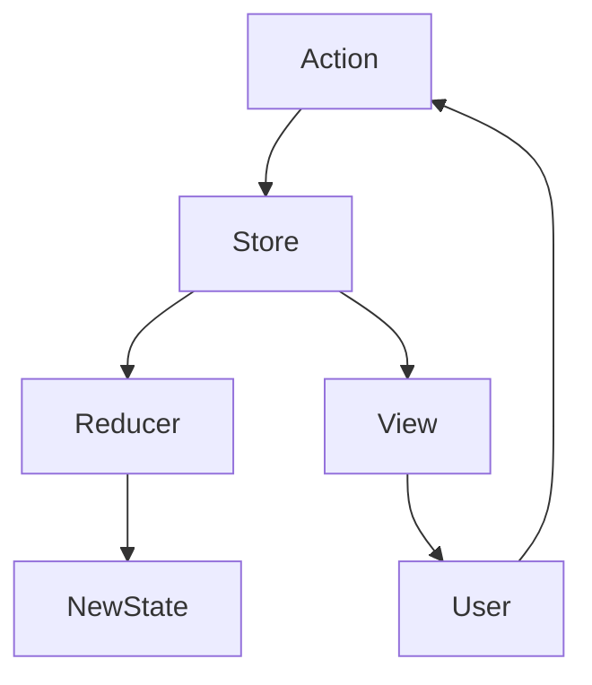
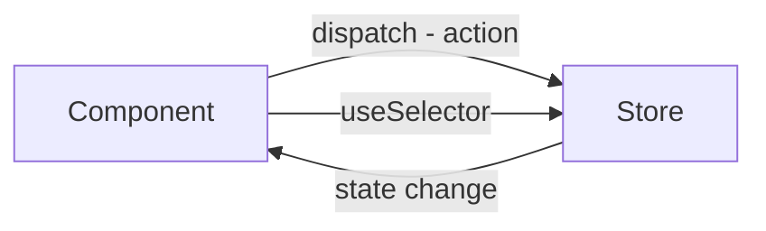
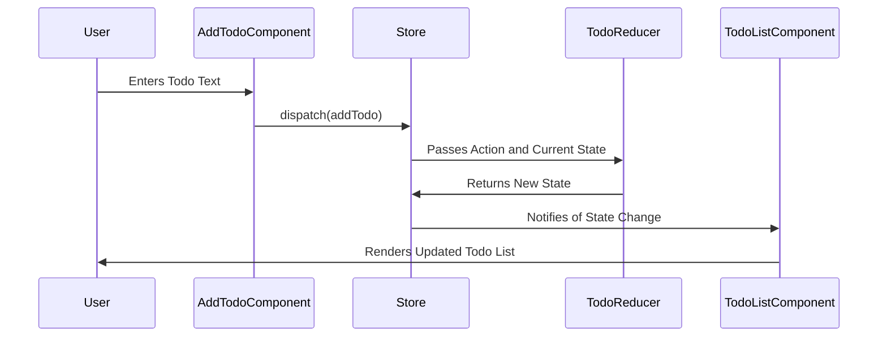

# Introduction to Redux for React Beginners

Now that you have a solid understanding of the basics of React, it's an excellent time to delve into **Redux**, a powerful state management library commonly used with React applications.

In this comprehensive guide, we'll cover:

1. **What is Redux?**
2. **Why Use Redux?**
3. **Core Concepts of Redux**
4. **Setting Up Redux in a React Application**
5. **Redux with React Hooks**
6. **Practical Examples**
7. **Context API vs. Redux**
8. **Best Practices and Things to Be Aware Of**
9. **Additional Resources**

We'll provide detailed explanations, multiple examples, and diagrams to enhance your understanding.

---

## 1. What is Redux?

### Overview

**Redux** is a predictable state container for JavaScript applications. It helps you manage the state of your app in a single place, making it easier to understand, debug, and test.

- **Predictable**: State changes in a consistent and predictable manner.
- **Centralized**: The entire application state is stored in a single store.
- **Debuggable**: Tools like Redux DevTools allow you to track state changes over time.
- **Flexible**: Works with any UI layer, not just React.

### How Redux Works

Redux follows three fundamental principles:

1. **Single Source of Truth**: The state of your entire application is stored in a single object tree within a single store.
2. **State is Read-Only**: The only way to change the state is to emit an action, an object describing what happened.
3. **Changes are Made with Pure Functions**: To specify how the state tree is transformed by actions, you write pure reducers.

---

## 2. Why Use Redux?

### The Complexity of State Management in React

As your React application grows, managing state across multiple components can become complex:

- **Prop Drilling**: Passing props through components that don't need them just to reach the ones that do.
- **State Synchronization**: Keeping state synchronized between sibling components or components at different levels.
- **Complex Logic**: Handling asynchronous actions, such as API calls, can become cumbersome.

### How Redux Helps

- **Centralized State Management**: All application state is kept in one place, making it easier to manage and inspect.
- **Predictable State Changes**: By enforcing strict rules on how and when state can change, Redux makes your code more predictable.
- **Improved Debugging**: Redux DevTools allow you to time-travel debug your application.
- **Middleware Support**: Redux's middleware mechanism allows for powerful extensions, such as logging, crash reporting, and handling asynchronous actions.

### When to Use Redux

- **Complex State**: Applications with complex state interactions or where many components need access to the same data.
- **Predictability and Debugging**: When you need predictable state transitions and robust debugging tools.
- **Team Development**: In larger teams, Redux can help standardize state management.

---

## 3. Core Concepts of Redux

Understanding Redux's core concepts is crucial to using it effectively.

### 3.1 Store

#### What is the Store?

The **store** is an object that holds the application's state.

- **Single Source of Truth**: There is only one store in a Redux application.
- **Immutable State**: The state object is read-only and can only be changed by dispatching actions.

#### Store Responsibilities

- **Holds Application State**: Stores the current state tree of your application.
- **Allows Access to State**: `store.getState()`
- **Allows State to be Updated**: `store.dispatch(action)`
- **Registers Listeners**: `store.subscribe(listener)`

#### Diagram: Redux Store Interaction



**Explanation**:

- **Action**: Dispatched to the store.
- **Store**: Passes the action to the reducer.
- **Reducer**: Returns a new state based on the action.
- **Store**: Updates state and notifies the view.
- **View**: Renders based on the new state.
- **User**: Interacts with the view, potentially dispatching new actions.

### 3.2 Actions

#### What is an Action?

An **action** is a plain JavaScript object that describes a change to be made.

- **Type**: A string constant that indicates the type of action.
- **Payload**: (Optional) Additional data needed to perform the action.

#### Action Example

```javascript
// Action Type Constants
const INCREMENT = 'INCREMENT';
const ADD_TODO = 'ADD_TODO';

// Action Creators
function increment() {
  return { type: INCREMENT };
}

function addTodo(text) {
  return {
    type: ADD_TODO,
    payload: { text },
  };
}
```

### 3.3 Reducers

#### What is a Reducer?

A **reducer** is a pure function that takes the previous state and an action, and returns the next state.

- **Pure Function**: No side effects; doesn't mutate the state.
- **Signature**: `(state, action) => newState`

#### Reducer Example

```javascript
function counterReducer(state = { count: 0 }, action) {
  switch (action.type) {
    case 'INCREMENT':
      return { count: state.count + 1 };
    default:
      return state;
  }
}
```

### 3.4 Dispatch

#### What is Dispatching?

To change the state, you **dispatch** an action to the store.

- **Dispatch Function**: `store.dispatch(action)`
- **Triggers Reducer**: The store calls the reducer with the current state and the dispatched action.

#### Dispatch Example

```javascript
store.dispatch(increment());
```

### 3.5 Selectors

#### What is a Selector?

Selectors are functions that extract specific data from the state.

- **Encapsulation**: Hides the state structure from components.
- **Reusability**: Allows reuse of selection logic.

#### Selector Example

```javascript
const getCompletedTodos = (state) =>
  state.todos.filter((todo) => todo.completed);
```

---

## 4. Setting Up Redux in a React Application

Let's integrate Redux into a React application step by step.

### 4.1 Installing Redux and React-Redux

Install the necessary packages:

```bash
npm install redux react-redux
```

- **redux**: The core Redux library.
- **react-redux**: Official React bindings for Redux.

### 4.2 Creating a Redux Store

**store.js**

```javascript
import { createStore } from 'redux';
import rootReducer from './reducers';

const store = createStore(
  rootReducer,
  // Optional: Add Redux DevTools extension support
  window.__REDUX_DEVTOOLS_EXTENSION__ && window.__REDUX_DEVTOOLS_EXTENSION__()
);

export default store;
```

### 4.3 Creating Reducers

**reducers/index.js**

Combine multiple reducers if needed.

```javascript
import { combineReducers } from 'redux';
import counterReducer from './counterReducer';
import todoReducer from './todoReducer';

const rootReducer = combineReducers({
  counter: counterReducer,
  todos: todoReducer,
});

export default rootReducer;
```

**reducers/counterReducer.js**

```javascript
const initialState = {
  count: 0,
};

function counterReducer(state = initialState, action) {
  switch (action.type) {
    case 'INCREMENT':
      return {
        ...state,
        count: state.count + 1,
      };
    case 'DECREMENT':
      return {
        ...state,
        count: state.count - 1,
      };
    default:
      return state;
  }
}

export default counterReducer;
```

### 4.4 Providing the Store to React

Wrap your application with the `Provider` component.

**index.js**

```jsx
import React from 'react';
import ReactDOM from 'react-dom';
import { Provider } from 'react-redux';
import store from './store'; // Import the store
import App from './App';

ReactDOM.render(
  <Provider store={store}>
    <App />
  </Provider>,
  document.getElementById('root')
);
```

### 4.5 Connecting React Components to Redux

Use `useSelector` and `useDispatch` hooks.

**Counter.jsx**

```jsx
import React from 'react';
import { useSelector, useDispatch } from 'react-redux';

function Counter() {
  const count = useSelector((state) => state.counter.count);
  const dispatch = useDispatch();

  const increment = () => dispatch({ type: 'INCREMENT' });
  const decrement = () => dispatch({ type: 'DECREMENT' });

  return (
    <div>
      <h2>Counter Example</h2>
      <p>Count: {count}</p>
      <button onClick={decrement}>- Decrement</button>
      <button onClick={increment}>+ Increment</button>
    </div>
  );
}

export default Counter;
```

**Explanation**:

- **useSelector**: Accesses the `count` state from the `counter` reducer.
- **useDispatch**: Allows dispatching actions.

---

## 5. Redux with React Hooks

### Advantages of Using Hooks with Redux

- **Simplified Code**: Hooks provide a simpler API than the older `connect` method.
- **Functional Components**: Encourages the use of functional components.
- **Readability**: Cleaner and more readable code.

### 5.1 useSelector Hook

#### Purpose

Access data from the Redux store state.

#### Usage

```javascript
const data = useSelector((state) => state.someReducer.someData);
```

#### Example

```jsx
const todos = useSelector((state) => state.todos.items);
```

### 5.2 useDispatch Hook

#### Purpose

Get the `dispatch` function to send actions to the store.

#### Usage

```javascript
const dispatch = useDispatch();
```

#### Example

```jsx
const dispatch = useDispatch();

const addTodo = (text) => {
  dispatch({ type: 'ADD_TODO', payload: { text } });
};
```

### Diagram: React Component Interaction with Redux Store



---

## 6. Practical Examples

Let's build a simple Todo application using Redux.

### 6.1 Setting Up the Store

**store.js**

```javascript
import { createStore } from 'redux';
import rootReducer from './reducers';

const store = createStore(
  rootReducer,
  // Optional: Redux DevTools
  window.__REDUX_DEVTOOLS_EXTENSION__ && window.__REDUX_DEVTOOLS_EXTENSION__()
);

export default store;
```

### 6.2 Creating the Reducer

**reducers/todoReducer.js**

```javascript
const initialState = {
  items: [],
};

function todoReducer(state = initialState, action) {
  switch (action.type) {
    case 'ADD_TODO':
      return {
        ...state,
        items: [...state.items, action.payload],
      };
    case 'REMOVE_TODO':
      return {
        ...state,
        items: state.items.filter((_, index) => index !== action.payload),
      };
    default:
      return state;
  }
}

export default todoReducer;
```

**reducers/index.js**

```javascript
import { combineReducers } from 'redux';
import todoReducer from './todoReducer';

const rootReducer = combineReducers({
  todos: todoReducer,
});

export default rootReducer;
```

### 6.3 Creating Action Creators

**actions/todoActions.js**

```javascript
export const addTodo = (text) => ({
  type: 'ADD_TODO',
  payload: { text },
});

export const removeTodo = (index) => ({
  type: 'REMOVE_TODO',
  payload: index,
});
```

### 6.4 Connecting Components

#### AddTodo Component

**components/AddTodo.jsx**

```jsx
import React, { useState } from 'react';
import { useDispatch } from 'react-redux';
import { addTodo } from '../actions/todoActions';

function AddTodo() {
  const [text, setText] = useState('');
  const dispatch = useDispatch();

  const handleAdd = () => {
    if (text.trim()) {
      dispatch(addTodo(text));
      setText('');
    }
  };

  return (
    <div>
      <h3>Add Todo</h3>
      <input
        type='text'
        value={text}
        onChange={(e) => setText(e.target.value)}
        placeholder='Enter todo...'
      />
      <button onClick={handleAdd}>Add</button>
    </div>
  );
}

export default AddTodo;
```

#### TodoList Component

**components/TodoList.jsx**

```jsx
import React from 'react';
import { useSelector, useDispatch } from 'react-redux';
import { removeTodo } from '../actions/todoActions';

function TodoList() {
  const items = useSelector((state) => state.todos.items);
  const dispatch = useDispatch();

  const handleRemove = (index) => {
    dispatch(removeTodo(index));
  };

  return (
    <div>
      <h3>Todo List</h3>
      <ul>
        {items.map((todo, index) => (
          <li key={index}>
            {todo.text}{' '}
            <button onClick={() => handleRemove(index)}>Delete</button>
          </li>
        ))}
      </ul>
    </div>
  );
}

export default TodoList;
```

#### App Component

**App.jsx**

```jsx
import React from 'react';
import AddTodo from './components/AddTodo';
import TodoList from './components/TodoList';

function App() {
  return (
    <div>
      <h1>Todo App with Redux</h1>
      <AddTodo />
      <TodoList />
    </div>
  );
}

export default App;
```

### Diagram: Todo Application Data Flow



---

## 7. Context API vs. Redux

### Do You Need to Know Context API Before Learning Redux?

While it's not strictly necessary to understand the Context API before learning Redux, it's helpful to know about it to make informed decisions about state management in your React applications.

### What is the Context API?

The **Context API** is a feature of React that allows you to pass data through the component tree without having to pass props down manually at every level.

- **Use Cases**: Theming, user authentication status, locale settings.
- **Limitations**: Not designed for complex state management.

### Comparing Context API and Redux

| Aspect                 | Context API                         | Redux                         |
| ---------------------- | ----------------------------------- | ----------------------------- |
| **Purpose**            | Passing data through component tree | Predictable state management  |
| **State Management**   | Basic                               | Advanced                      |
| **API Complexity**     | Simple                              | More Complex                  |
| **Performance**        | Can cause unnecessary re-renders    | Optimized with selectors      |
| **Middleware Support** | Limited                             | Extensive (e.g., Thunk, Saga) |
| **DevTools**           | None                                | Powerful debugging tools      |

### When to Use Context API

- **Simple State Sharing**: When you need to pass data to multiple components without prop drilling.
- **Static Data**: For data that doesn't change frequently.

### When to Use Redux

- **Complex State Logic**: When you have complex state interactions.
- **Asynchronous Operations**: Handling complex async logic like API calls.
- **Large Applications**: For better state organization and predictability.

### Can Context API Replace Redux?

In some cases, yes. For small to medium-sized applications with straightforward state management needs, the Context API might suffice. However, Redux offers more robust solutions for larger, more complex applications.

---

## 8. Best Practices and Things to Be Aware Of

### 8.1 When to Use Redux

- **Assess Complexity**: Only introduce Redux if your state management needs justify the added complexity.
- **Gradual Introduction**: Start with local state and lift state up as needed. Introduce Redux when prop drilling becomes unmanageable.

### 8.2 Immutability is Key

- **Avoid Mutating State**: Always return new state objects from reducers.
- **Use Immutable Methods**: Use methods that do not mutate the original array or object.

#### Common Mistakes

- **Incorrect**:

  ```javascript
  state.items.push(action.payload); // Mutates state
  return state;
  ```

- **Correct**:

  ```javascript
  return {
    ...state,
    items: [...state.items, action.payload],
  };
  ```

### 8.3 Use Redux Toolkit

**Redux Toolkit** simplifies Redux development by providing:

- **Simplified Store Setup**: `configureStore` sets up the store with good defaults.
- **Simplified Reducers**: `createSlice` reduces boilerplate in reducers.
- **Includes Middleware**: Comes with `redux-thunk` by default.

#### Example with Redux Toolkit

**store.js**

```javascript
import { configureStore } from '@reduxjs/toolkit';
import todoSlice from './slices/todoSlice';

const store = configureStore({
  reducer: {
    todos: todoSlice.reducer,
  },
});

export default store;
```

**slices/todoSlice.js**

```javascript
import { createSlice } from '@reduxjs/toolkit';

const todoSlice = createSlice({
  name: 'todos',
  initialState: [],
  reducers: {
    addTodo: (state, action) => {
      state.push({ text: action.payload });
    },
    removeTodo: (state, action) => {
      return state.filter((_, index) => index !== action.payload);
    },
  },
});

export const { addTodo, removeTodo } = todoSlice.actions;

export default todoSlice;
```

### 8.4 Handling Asynchronous Actions

Use middleware like **Redux Thunk** or **Redux Saga** to handle asynchronous logic.

#### Redux Thunk Example

**actions/todoActions.js**

```javascript
export const fetchTodos = () => {
  return async (dispatch) => {
    dispatch({ type: 'FETCH_TODOS_REQUEST' });
    try {
      const response = await fetch('/api/todos');
      const data = await response.json();
      dispatch({ type: 'FETCH_TODOS_SUCCESS', payload: data });
    } catch (error) {
      dispatch({ type: 'FETCH_TODOS_FAILURE', payload: error });
    }
  };
};
```

#### Handling Async Actions in Reducer

**reducers/todoReducer.js**

```javascript
function todoReducer(state = initialState, action) {
  switch (action.type) {
    case 'FETCH_TODOS_REQUEST':
      return {
        ...state,
        loading: true,
      };
    case 'FETCH_TODOS_SUCCESS':
      return {
        ...state,
        loading: false,
        items: action.payload,
      };
    case 'FETCH_TODOS_FAILURE':
      return {
        ...state,
        loading: false,
        error: action.payload,
      };
    // ... other cases
    default:
      return state;
  }
}
```

### 8.5 Avoid Common Pitfalls

- **Overusing Redux**: Not all state needs to be in Redux. Use local component state for UI-specific data.
- **Naming Conflicts**: Use constants for action types to avoid typos.
- **Performance Issues**: Be cautious with large state trees; use selectors and memoization to optimize performance.

### 8.6 Debugging with Redux DevTools

- **Installation**: Install the Redux DevTools extension for your browser.
- **Usage**: Monitor actions, state changes, and time-travel debug.

**Store Configuration**

```javascript
import { configureStore } from '@reduxjs/toolkit';

const store = configureStore({
  reducer: rootReducer,
  devTools: process.env.NODE_ENV !== 'production',
});
```

---

## 9. Additional Resources

- **Official Redux Documentation**: [Redux](https://redux.js.org/)
- **Redux Toolkit Documentation**: [Redux Toolkit](https://redux-toolkit.js.org/)
- **React Redux Documentation**: [React Redux](https://react-redux.js.org/)
- **Redux Essentials Tutorial**: [Redux Essentials](https://redux.js.org/tutorials/essentials/part-1-overview-concepts)
- **Getting Started with Redux** by Dan Abramov: [Video Series](https://egghead.io/courses/getting-started-with-redux)
- **Redux Thunk Documentation**: [Redux Thunk](https://github.com/reduxjs/redux-thunk)
- **Redux Saga Documentation**: [Redux Saga](https://redux-saga.js.org/)
- **Building Modern Projects with React and Redux**: Books and online courses

---

# Conclusion

Redux is a powerful tool for managing complex state in React applications. By understanding its core concepts, leveraging React hooks, and following best practices, you can effectively integrate Redux into your projects.

**Key Takeaways**:

- **Understand Core Concepts**: Actions, reducers, store, and dispatch are fundamental.
- **Use React-Redux Hooks**: `useSelector` and `useDispatch` simplify integration.
- **Consider Redux Toolkit**: Simplifies development and encourages best practices.
- **Evaluate Necessity**: Use Redux when your application's complexity warrants it.
- **Know Context API**: Understand when to use Context API vs. Redux.

**Next Steps**:

- **Practice**: Build small projects to apply what you've learned.
- **Explore Middleware**: Learn about Redux Thunk and Redux Saga for async actions.
- **Optimize**: Use selectors and memoization to improve performance.
- **Stay Updated**: Keep up with the latest Redux best practices and updates.
